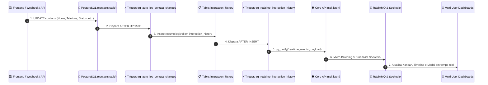

# 🎯 Architecture Spec: Captacao Funnel, Psychologist CRM & Realtime Lead Auditing

> **Scope**: Patient lead capture forms, CRM Kanban board, lead status pipeline, automatic PostgreSQL change audit triggers, and real-time Socket.io multi-user synchronization.

---

## 🎯 1. Scope & Triggers

Read this context when:
- Modifying lead capture flows (`/v1/crm/webhook`, screening forms, landing page submissions).
- Editing the psychologist CRM Kanban board, pipeline column structure, or lead cards.
- Updating contact properties or interaction timeline logic (`contacts` and `interaction_history` tables).
- Configuring real-time Socket.io events (`lead`, `interaction_history`, `pipeline_column`).

---

## ⚡ 2. Inviolable Directives (ALWAYS / NEVER)

1. **ALWAYS rely on the PostgreSQL Audit Trigger `trg_auto_log_contact_changes` for lead field change tracking**:
   - NEVER insert manual audit logs in application code when updating lead attributes (Name, Phone, Email, Status, Source, Notes, Emergency Contact, Minor/Legal Guardian status, Next Contact Date, Custom Fields).
   - The PostgreSQL trigger automatically detects `OLD` vs `NEW` value diffs and inserts structured natural-language logs into `interaction_history`.
2. **ALWAYS standardize multi-tenant room routing with `workspaceId` / `workspace_id`**:
   - Socket.io connections subscribe to `workspace:${workspaceId}`.
   - Realtime events broadcast to all active sessions connected to the target workspace.
3. **NEVER create duplicate lead cards on re-registrations**:
   - If an incoming webhook or form submission contains a phone/email already registered in the workspace, append a duplicate note to `interaction_history` without duplicating the `contacts` row.
4. **ALWAYS enforce Row Level Security (RLS) on `contacts` and `interaction_history`**:
   - Ensure `is_workspace_member(workspace_id)` or `is_platform_admin()` grants access.

---

## 🏗️ 3. Feature Architecture & Flowchart



---

## 📖 4. Concrete Code Recipes & Schemas

### Database Audit Trigger (`backend/drizzle/0018_add_contact_audit_trigger.sql`)
```sql
CREATE OR REPLACE FUNCTION public.auto_log_contact_changes()
RETURNS trigger AS $$
DECLARE
  changes text[] := ARRAY[]::text[];
  log_type text := 'contact_update';
  summary_text text;
BEGIN
  IF OLD IS NOT DISTINCT FROM NEW THEN
    RETURN NEW;
  END IF;

  IF OLD.name IS DISTINCT FROM NEW.name THEN
    changes := array_append(changes, format('Nome alterado de "%s" para "%s"', COALESCE(OLD.name, '-'), COALESCE(NEW.name, '-')));
  END IF;

  IF OLD.status IS DISTINCT FROM NEW.status THEN
    log_type := 'status_change';
    changes := array_append(changes, format('Estágio alterado de "%s" para "%s"', COALESCE(OLD.status, '-'), COALESCE(NEW.status, '-')));
  END IF;

  IF array_length(changes, 1) > 0 THEN
    summary_text := array_to_string(changes, E'\n• ');
    INSERT INTO public.interaction_history (contact_id, workspace_id, type, notes)
    VALUES (NEW.id, NEW.workspace_id, log_type, '• ' || summary_text);
  END IF;

  RETURN NEW;
END;
$$ LANGUAGE plpgsql SECURITY DEFINER;
```

---

## 🚫 5. Anti-Patterns & Prohibitions

### ❌ WRONG: Creating manual status logs in frontend actions alongside DB updates
```typescript
// ❌ INCORRETO: Gera duplicidade de logs e pode omitir alterações feitas via API/PostgREST
await api.updateContact(contactId, { status: toStatus });
await api.createInteractionHistory({ contact_id: contactId, notes: 'Status alterado' });
```

### ✅ CORRECT: Let the database trigger manage audit logs automatically
```typescript
// ✅ CORRETO: Apenas atualize o registro; o banco de dados gera o histórico e notifica via Realtime
await api.updateContact(contactId, { status: toStatus });
```
