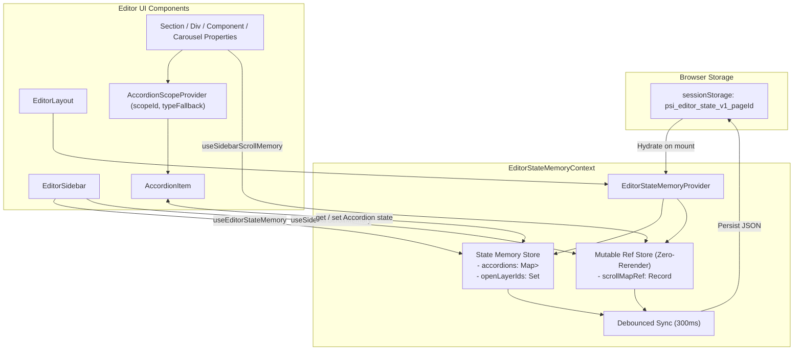

# 🧠 System Architecture & Data Flow — Editor State Memory System (Accordions, Layers & Sidebar Scroll)

> **Scope**: Centralized state memory for the PSI-APP Site Editor. Preserves open/closed accordion states per element and sidebar panel, expanded tree layer IDs, and scroll positions across properties panels, element catalog, settings, and layer navigation. Fully persisted in `sessionStorage` per page.

---

## 🎯 1. Scope & Triggers

Read this context document when:
- Modifying accordion behavior in the site editor sidebar or property panels (`PropertiesPanel/*`, `AccordionSection.tsx`).
- Adjusting scroll memory or persistence across tabs (`SidebarSettingsPanel.tsx`, `AddPalette.tsx`, `NavbarPanel.tsx`, `EditorSidebar/index.tsx`).
- Updating layer tree expansion (`openLayerIds`) or adding new scoped panels.
- Resolving state loss, scroll reset, or accordion state bugs during element selection changes.

---

## ⚡ 2. Inviolable Directives (ALWAYS / NEVER)

1. **ALWAYS scope accordion states hierarchically**:
   - Primary key: Element instance ID (`element:<nodeId>`).
   - Secondary fallback: Element type (`type:section`, `type:div`, `type:component`, `type:carousel`) when an unvisited element is selected.
   - Static panel keys: `panel:add`, `panel:settings`, `panel:navbar`.
   - Default fallback: Component `defaultOpen` prop if no memory exists.
2. **ALWAYS scope scroll position memory per container key**:
   - Property panels: `properties:element:<nodeId>`.
   - Sidebar panels: `sidebar:panel:add`, `sidebar:panel:layers`, `sidebar:panel:settings`, `sidebar:panel:navbar`.
3. **ALWAYS debounce `sessionStorage` updates**:
   - Use a debounced timer (300ms) to sync in-memory state updates (`psi_editor_state_v1_<pageId>`) to prevent blocking main thread frame rates during smooth scrolling or accordion animation.
4. **ALWAYS restore scroll position asynchronously**:
   - Use `useIsomorphicLayoutEffect` bound ONLY to `key` when restoring `scrollTop` on mount or key change to ensure DOM reflow and height calculations are complete.
5. **NEVER store transient navigation state in unpersisted component local state**:
   - Accordion states in property panels must be linked to `AccordionScopeContext` so switching between elements preserves individual panel memory.
6. **NEVER trigger React state updates inside `saveScrollPosition` during scroll**:
   - Scroll positions MUST be stored in mutable refs (`scrollMapRef.current`) inside `EditorStateMemoryProvider`. Updating React state on every scroll event forces the entire `EditorLayout` and `CanvasOverlay` to re-render 60-120 times per second, causing layout thrashing, scroll lag, and screen shaking/jittering.

---

## 📐 3. Feature Architecture & Flowchart



---

## 🛠️ 4. Concrete Code Recipes & Schemas

### 📄 SessionStorage Schema (`psi_editor_state_v1_<pageId>`)

```json
{
  "accordions": {
    "element:sec_170000_1": ["sec-layout", "sec-background"],
    "type:section": ["sec-layout"],
    "panel:settings": ["site-typography", "site-colors"]
  },
  "openLayerIds": ["sec_170000_1", "div_170000_2"],
  "scrollPositions": {
    "properties:element:sec_170000_1": 240,
    "sidebar:panel:layers": 120,
    "sidebar:panel:add": 0
  }
}
```

---

### 🟢 Recipe 1: Wrapping Property Panels with Accordion Scope & Scroll Memory

```tsx
import { AccordionScopeProvider } from './components/AccordionSection';
import { useSidebarScrollMemory } from '../context/EditorStateMemoryContext';

export function SectionProperties({ section }: SectionPropertiesProps) {
  const { containerRef: sectionScrollRef, handleScroll: handleSectionScroll } = 
    useSidebarScrollMemory(`properties:element:${section.id}`);

  return (
    <AccordionScopeProvider scopeId={`element:${section.id}`} typeFallback="type:section">
      <div className="flex flex-col h-full text-xs select-none">
        {/* Header */}
        <div className="p-3 border-b ...">...</div>

        {/* Scrollable Container */}
        <div ref={sectionScrollRef} onScroll={handleSectionScroll} className="flex-1 p-3 space-y-3 overflow-y-auto">
          <AccordionItem id="sec-layout" title="Layout & Alinhamento">
            ...
          </AccordionItem>
        </div>
      </div>
    </AccordionScopeProvider>
  );
}
```

---

### 🟢 Recipe 2: Automatic Accordion State Sync in `AccordionItem`

```tsx
export const AccordionItem: React.FC<AccordionItemProps> = ({ id, defaultOpen = true, children }) => {
  const scope = useAccordionScope();
  const memory = useEditorStateMemory();

  // If inside an AccordionScopeProvider, use memory store with fallback to defaultOpen
  const isOpen = scope && memory
    ? memory.isAccordionOpen(scope.scopeId, id, scope.typeFallback, defaultOpen)
    : localIsOpen;

  const toggle = () => {
    if (scope && memory) {
      memory.toggleAccordion(scope.scopeId, id, scope.typeFallback, defaultOpen);
    } else {
      setLocalIsOpen(!localIsOpen);
    }
  };

  // ... render details / summary toggle button
};
```

---

## 🚫 5. Anti-Patterns & Prohibitions

| ❌ Anti-Pattern | Why It Breaks | ✅ Correct Approach |
|---|---|---|
| Using static global keys like `"layout"` without scope prefixing | Toggling layout accordion on Section A opens/closes layout on all Divs and Components | ALWAYS use `AccordionScopeProvider` with `element:<nodeId>` and type fallbacks |
| Writing to `sessionStorage` synchronously on every scroll event (`onScroll`) | Causes continuous disk/serialization IO, freezing UI during fast scrolling | ALWAYS use debounced batch persistence (`syncToStorage` 300ms) |
| Storing `scrollMap` in React `useState` and updating state on scroll | Forces `EditorStateMemoryProvider` and entire `EditorLayout` to re-render 60-120 times/sec, causing layout thrashing, scroll lag, and screen shaking | ALWAYS store scroll positions in mutable `scrollMapRef.current` with ZERO React state updates |
| Restoring `scrollTop` inside `useEffect` with `memory` object in dependencies | Fires `scrollTop` assignments repeatedly mid-scroll, fighting native browser scroll physics | Use `useIsomorphicLayoutEffect` with `[key]` as sole dependency |
