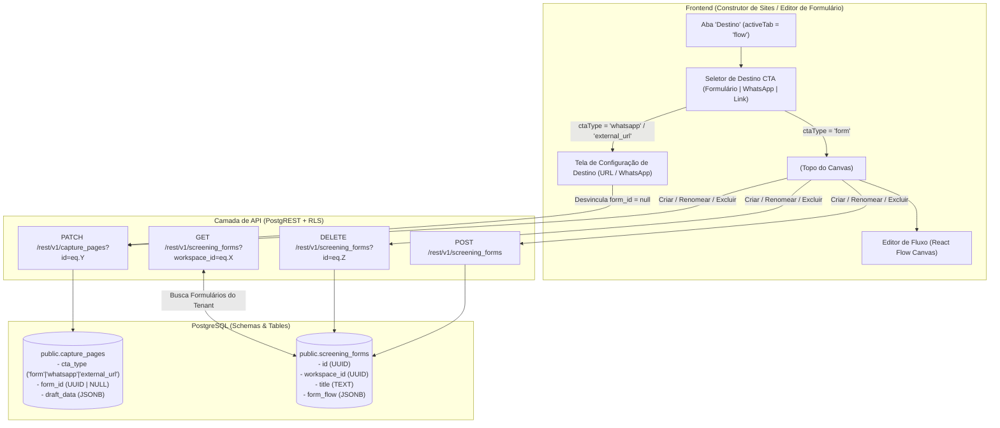

# 📋 Architecture Spec: Form Builder, Destino CTA & Relacionamento Página-Formulário

> **Scope**: Gestão de formulários de triagem, tipos de destino do CTA (Formulário, WhatsApp Direto, Link Externo), relacionamento relacional no banco de dados (`public.capture_pages.form_id` ↔ `public.screening_forms.id`) e o componente `<FormManagerSelect />`.

---

## ⚡ 1. Inviolable Directives (Regras de Ouro da Funcionalidade)

1. **ALWAYS sync `form_id` according to `cta_type`**:
   - Quando `cta_type === 'form'`, a coluna `form_id` (e `draft_data.formId` no rascunho) **DEVE** conter a chave primária `UUID` do formulário ativo em `public.screening_forms`.
   - Quando `cta_type` for alterado para `'whatsapp'` ou `'external_url'`, a aplicação **DEVE** zerar `form_id = null` e `draft_data.formId = null`, desfazendo explicitamente o relacionamento no PostgreSQL.
2. **ALWAYS isolate workspace forms by `workspace_id`**:
   - Formulários em `public.screening_forms` pertencem estritamente a um `workspace_id`.
   - Consultas de formulários devem sempre filtrar por `workspace_id=eq.<tenantId>` sob politicas de RLS.
3. **NEVER mix React Flow Canvas with URL/WhatsApp destination view**:
   - Se `cta_type` for `'whatsapp'` ou `'external_url'`, o canvas do React Flow **NÃO** deve ser exibido. No lugar do canvas, a tela principal exibe a **Tela de Configurações de Destino da URL/WhatsApp**.
   - Se `cta_type` for `'form'`, o canvas do React Flow exibe o fluxograma interativo do formulário vinculado.
4. **ALWAYS perform reactive canvas reload on form selection**:
   - Ao trocar de formulário no `<FormManagerSelect />`, a aplicação **DEVE** resetar os nós e arestas (`setNodes([])`, `setEdges([])`) e carregar reativamente a estrutura `formFlowDraft` ou `formFlow` do novo formulário.
5. **ALWAYS support inline Form CRUD inside `<FormManagerSelect />`**:
   - O seletor `<FormManagerSelect />` permite **Criar** (`api.createForm`), **Renomear** (`api.updateForm`) e **Excluir** (`api.deleteForm`) formulários diretamente no menu suspenso sem sair da tela do construtor.

---

## 🏗️ 2. Feature Architecture & Flowchart

### Data Flow Diagram (Página ↔ Formulário ↔ Destino CTA)



---

## 💻 3. Concrete Code Recipes & Schemas

### Database Schema Definition (`public.capture_pages` & `public.screening_forms`)

```sql
-- Relacionamento na tabela de Páginas de Captação
ALTER TABLE public.capture_pages 
  ADD COLUMN IF NOT EXISTS cta_type TEXT DEFAULT 'form',
  ADD COLUMN IF NOT EXISTS cta_whatsapp_message TEXT,
  ADD COLUMN IF NOT EXISTS cta_external_url TEXT,
  ADD COLUMN IF NOT EXISTS form_id UUID REFERENCES public.screening_forms(id) ON DELETE SET NULL;

-- Tabela de Formulários de Triagem
CREATE TABLE IF NOT EXISTS public.screening_forms (
  id UUID PRIMARY KEY DEFAULT gen_random_uuid(),
  workspace_id UUID NOT NULL REFERENCES public.workspaces(id) ON DELETE CASCADE,
  title TEXT NOT NULL,
  slug TEXT NOT NULL,
  is_active BOOLEAN DEFAULT true,
  theme_config JSONB DEFAULT '{}'::jsonb,
  form_flow JSONB DEFAULT '{}'::jsonb,
  draft_data JSONB,
  created_at TIMESTAMPTZ DEFAULT now(),
  updated_at TIMESTAMPTZ DEFAULT now()
);
```

---

### Component Contract: `<FormManagerSelect />`

```tsx
import { FormManagerSelect } from '@/components/FormManagerSelect';

<FormManagerSelect
  forms={availableForms}
  selectedFormId={page?.formId || availableForms[0]?.id || null}
  onSelectForm={handleFormSelect}
  onCreateForm={handleCreateForm}
  onRenameForm={handleRenameForm}
  onDeleteForm={handleDeleteForm}
  placeholder="Selecione um formulário..."
  className="w-64"
/>
```

---

### Receita: Troca Reativa de Formulário no Canvas (`handleFormSelect`)

```typescript
const handleFormSelect = useCallback((selectedId: string) => {
  if (!page) return;
  const selectedForm = availableForms.find((f: any) => f.id === selectedId);
  const newFormFlow = selectedForm?.formFlowDraft || selectedForm?.formFlow || { nodes: [], edges: [] };

  // 1. Limpa canvas do React Flow para forçar rebuild limpo
  setNodes([]);
  setEdges([]);

  // 2. Atualiza estado da página com novo formId e formFlow
  setPage(prev => {
    if (!prev) return prev;
    return {
      ...prev,
      formId: selectedId,
      formFlow: newFormFlow,
    };
  });
  setHasUnsavedChanges(true);
}, [page, availableForms, setNodes, setEdges]);
```

---

## 🚫 4. Anti-Patterns & Prohibitions

### ❌ Incorreto: Alterar o `formId` sem atualizar o `formFlow` e zerar o canvas
```typescript
// ERRADO: Apenas muda a string formId mas deixa o canvas mostrando os nós do formulário antigo
const handleFormSelectBad = (selectedId: string) => {
  setPage({ ...page, formId: selectedId }); // ❌ O canvas não atualiza!
};
```

### ✅ Correto: Resetar nós/arestas e carregar o `formFlow` correspondente
```typescript
// CORRETO: Reseta o canvas e copia a estrutura formFlow do novo formulário
const handleFormSelectGood = (selectedId: string) => {
  const targetForm = availableForms.find(f => f.id === selectedId);
  setNodes([]);
  setEdges([]);
  setPage({
    ...page,
    formId: selectedId,
    formFlow: targetForm?.formFlowDraft || targetForm?.formFlow || { nodes: [], edges: [] }
  });
  setHasUnsavedChanges(true);
};
```

---

### ❌ Incorreto: Manter o `form_id` preenchido quando `cta_type` for WhatsApp ou Link Externo
```typescript
// ERRADO: Mudar para WhatsApp mas deixar o form_id antigo no banco
setPage({ ...page, ctaType: 'whatsapp' }); // ❌ Múltiplas fontes de verdade!
```

### ✅ Correto: Desvincular explicitamente o `form_id = null` ao mudar para WhatsApp ou URL Externa
```typescript
// CORRETO: Zerar form_id para desvincular o formulário no banco de dados
setPage({ ...page, ctaType: 'whatsapp', formId: null });
setHasUnsavedChanges(true);
```
