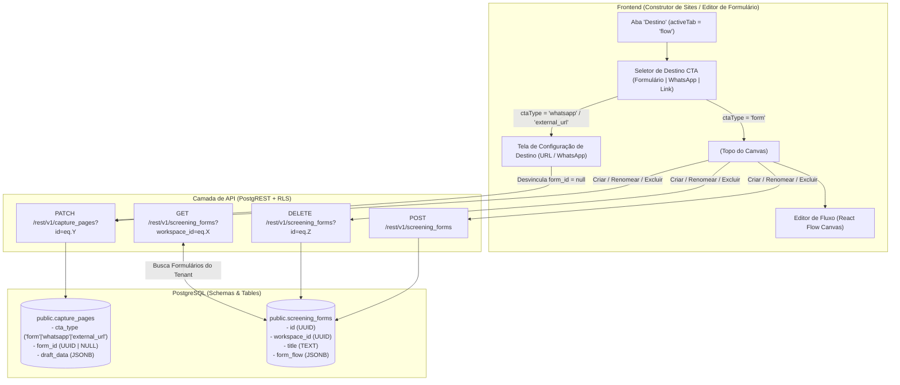

# 📋 Architecture Spec: Form Builder, Destino CTA & Relacionamento Página-Formulário

> **Scope**: Gestão de formulários de triagem, tipos de destino do CTA (Formulário, WhatsApp Direto, Link Externo), relacionamento relacional no banco de dados (`public.capture_pages.form_id` ↔ `public.screening_forms.id`) e o componente `<FormManagerSelect />`.

---

## 1. Scope & Triggers

Read this document when:
- Working on screening forms builder (`frontend/apps/web/src/app/dashboard/triagem/`)
- Modifying CTA destination settings (Form, WhatsApp, External URL) in site editor or wizard
- Updating `<FormManagerSelect />` dropdown or form selection state
- Altering the DB schema for `screening_forms` or `capture_pages.form_id`

---

## 2. Inviolable Directives (ALWAYS / NEVER)

### Database Relationship & State Sync
1. **ALWAYS sync `form_id` according to `cta_type`**:
   - When `cta_type === 'form'`, `public.capture_pages.form_id` (and `draft_data.formId` in draft) **MUST** contain the primary key `UUID` of an active screening form in `public.screening_forms`.
   - When `cta_type` is changed to `'whatsapp'` or `'external_url'`, the application **MUST** set `form_id = null` and `draft_data.formId = null`, explicitly severing the database relationship.
2. **ALWAYS isolate workspace forms by `workspace_id`**:
   - Screening forms in `public.screening_forms` belong strictly to a single `workspace_id`.
   - Form queries MUST filter by `workspace_id=eq.<tenantId>` under active RLS policies.

### Form Builder UI/UX
3. **NEVER mix React Flow Canvas with URL/WhatsApp destination view**:
   - When `cta_type` is `'whatsapp'` or `'external_url'`, the React Flow canvas **MUST NOT** be rendered. In its place, the main screen displays the **Destination Settings Card** (WhatsApp message text or External URL input).
   - When `cta_type` is `'form'`, the React Flow canvas displays the interactive flowchart nodes and edges for the linked screening form.
4. **ALWAYS perform reactive canvas reload on form selection**:
   - Swapping forms in `<FormManagerSelect />` **MUST** reset nodes and edges (`setNodes([])`, `setEdges([])`) and reload the `formFlowDraft` or `formFlow` structure of the newly selected form cleanly.
5. **ALWAYS support inline Form CRUD inside `<FormManagerSelect />`**:
   - The dropdown `<FormManagerSelect />` allows users to **Create** (`api.createForm`), **Rename** (`api.updateForm`), and **Delete** (`api.deleteForm`) forms directly from the select menu without leaving the editor page.

---

## 3. Feature Architecture & UI/UX Design System



---

## 4. Concrete Code Recipes & Schemas

### Database Schema Definition (`public.capture_pages` & `public.screening_forms`)

```sql
-- Relacionamento na tabela de Páginas de Captação
ALTER TABLE public.capture_pages 
  ADD COLUMN IF NOT EXISTS cta_type TEXT DEFAULT 'form',
  ADD COLUMN IF NOT EXISTS cta_whatsapp_message TEXT,
  ADD COLUMN IF NOT EXISTS cta_external_url TEXT,
  ADD COLUMN IF NOT EXISTS form_id UUID REFERENCES public.screening_forms(id) ON DELETE SET NULL;

-- Tabela de Formulários de Triagem
CREATE TABLE IF NOT EXISTS public.screening_forms (
  id UUID PRIMARY KEY DEFAULT gen_random_uuid(),
  workspace_id UUID NOT NULL REFERENCES public.workspaces(id) ON DELETE CASCADE,
  title TEXT NOT NULL,
  slug TEXT NOT NULL,
  is_active BOOLEAN DEFAULT true,
  theme_config JSONB DEFAULT '{}'::jsonb,
  form_flow JSONB DEFAULT '{}'::jsonb,
  draft_data JSONB,
  created_at TIMESTAMPTZ DEFAULT now(),
  updated_at TIMESTAMPTZ DEFAULT now()
);
```

### Component Contract: `<FormManagerSelect />`

```tsx
import { FormManagerSelect } from '@/components/FormManagerSelect';

<FormManagerSelect
  forms={availableForms}
  selectedFormId={page?.formId || availableForms[0]?.id || null}
  onSelectForm={handleFormSelect}
  onCreateForm={handleCreateForm}
  onRenameForm={handleRenameForm}
  onDeleteForm={handleDeleteForm}
  placeholder="Selecione um formulário..."
  className="w-64"
/>
```

### Reactive Form Swap Handler (`handleFormSelect`)

```typescript
const handleFormSelect = useCallback((selectedId: string) => {
  if (!page) return;
  const selectedForm = availableForms.find((f: any) => f.id === selectedId);
  const newFormFlow = selectedForm?.formFlowDraft || selectedForm?.formFlow || { nodes: [], edges: [] };

  // 1. Reset React Flow nodes and edges for clean canvas rebuild
  setNodes([]);
  setEdges([]);

  // 2. Update page state with new formId and formFlow
  setPage(prev => {
    if (!prev) return prev;
    return {
      ...prev,
      formId: selectedId,
      formFlow: newFormFlow,
    };
  });
  setHasUnsavedChanges(true);
}, [page, availableForms, setNodes, setEdges]);
```

---

## 5. Anti-Patterns & Prohibitions

### ❌ ERRADO: Manter o `form_id` preenchido quando `cta_type` for trocado para WhatsApp ou Link Externo
```typescript
// NUNCA faça isso: gera inconsistência no banco com 2 tipos de destinos ativos ao mesmo tempo
setPage({ ...page, ctaType: 'whatsapp' }); // ❌ form_id continua apontando para um formulário antigo!
```

### ✅ CORRETO: Desvincular explicitamente `form_id = null`
```typescript
// CORRETO: Zerar form_id desvincula o formulário no banco de dados
setPage({ ...page, ctaType: 'whatsapp', formId: null });
setHasUnsavedChanges(true);
```

---

### ❌ ERRADO: Alterar o `formId` sem zerar os nós do React Flow
```typescript
// NUNCA faça isso: a UI mostrará visualmente os nós do formulário anterior
const handleFormSelectBad = (selectedId: string) => {
  setPage({ ...page, formId: selectedId }); // ❌ O canvas não atualiza limpo!
};
```

### ✅ CORRETO: Resetar os nós/arestas e recarregar a estrutura `formFlow` do novo formulário
```typescript
// CORRETO: Zera o canvas e carrega a estrutura formFlow do novo formulário
const handleFormSelectGood = (selectedId: string) => {
  const targetForm = availableForms.find(f => f.id === selectedId);
  setNodes([]);
  setEdges([]);
  setPage({
    ...page,
    formId: selectedId,
    formFlow: targetForm?.formFlowDraft || targetForm?.formFlow || { nodes: [], edges: [] },
  });
  setHasUnsavedChanges(true);
};
```
