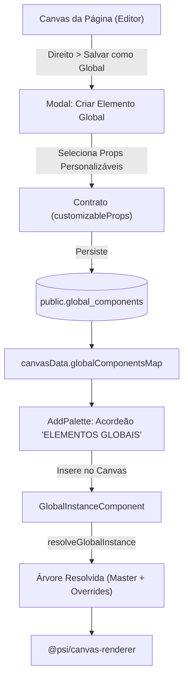

# 🌐 Arquitetura de Elementos Globais Reutilizáveis (Global Component Engine)

> **Scope**: Especificação técnica, modelo de herança, fluxo de dados, schemas e regras de negócio para a criação, customização e reutilização de Elementos Globais no Visual Page Editor.

---

## ⚡ 1. Scope & Triggers

Leia este arquivo quando trabalhar em:
- Criação e gestão de Elementos Globais pelo usuário no Visual Page Editor
- Alterações no motor de herança (`resolveGlobalInstance.ts`)
- Configuração do modal de exposição de propriedades (`CreateGlobalComponentModal.tsx`)
- Listagem e inserção via sidebar (`AddPalette.tsx` — Acordeão "ELEMENTOS GLOBAIS")
- Painel de propriedades de instâncias globais (`GlobalInstanceProperties.tsx`)

---

## 🔒 2. Inviolable Directives (ALWAYS / NEVER)

1. **ALWAYS isolate Master Data from Instance Overrides**:
   - O nó `masterNode` (árvore de componentes raiz + todos os filhos) é mantido intacto em `globalComponentsMap[id]`.
   - Cada instância (`type: 'global_instance'`) armazena **APENAS** as propriedades explicitamente expostas pelo contrato em seu dicionário `instance.overrides[path]`.
2. **ALWAYS scope Global Components at the Workspace level**:
   - A tabela `public.global_components` utiliza RLS baseado no JWT `workspace_id`, permitindo reaproveitar o mesmo Elemento Global em qualquer página do consultório.
3. **ALWAYS display distinct visual chrome for Global Element instances**:
   - No canvas, a seleção de uma `global_instance` renderiza um contorno roxo/ciano (`outline-purple-500`) com badge superior `✨ Elemento Global: [Nome]`.
4. **NEVER lose master updates when rendering instances**:
   - Qualquer alteração na estrutura master (adicionar/remover filhos, trocar cor base) reflete automaticamente em todas as instâncias da página.
5. **ALWAYS support seamless Unlinking (Desvincular)**:
   - O usuário pode desvincular uma instância a qualquer momento via `PropertiesPanel`, convertendo-a em um nó estático normal sem perder as edições feitas.

---

## 🧜‍♂️ 3. Feature Architecture & Flowchart



---

## 📐 4. Concrete Code Recipes & Schemas

### Tabela PostgreSQL (`public.global_components`)

```typescript
export const globalComponents = pgTable('global_components', {
  id: uuid('id').primaryKey().defaultRandom(),
  workspaceId: uuid('workspace_id').references(() => workspaces.id, { onDelete: 'cascade' }).notNull(),
  name: text('name').notNull(),
  category: text('category').default('custom').notNull(),
  iconName: text('icon_name').default('Sparkles').notNull(),
  description: text('description'),
  masterNode: jsonb('master_node').notNull(),
  customizableProps: jsonb('customizable_props').default([]).notNull(),
  createdAt: timestamp('created_at', { withTimezone: true }).defaultNow().notNull(),
  updatedAt: timestamp('updated_at', { withTimezone: true }).defaultNow().notNull(),
});
```

### Exemplo de Instância no JSON da Página (`CanvasData`)

```json
{
  "id": "instance-abc-123",
  "type": "global_instance",
  "globalComponentId": "master-uuid-999",
  "overrides": {
    "root.props.text": "Título Customizado desta Página",
    "components[0].props.src": "https://r2.domain.com/avatar.jpg"
  }
}
```

---

## ❌ 5. Anti-Patterns & Proibições

### ❌ Errado (Duplicar o Nó Inteiro na Instância)
```typescript
// NUNCA copie toda a sub-árvore de filhos para dentro do objeto da instância!
// Isso quebra a herança automática quando o componente master for atualizado.
const badInstance = { ...masterNode, id: newId }; 
```

### ✅ Correto (Salvar Apenas Pointers e Overrides)
```typescript
const goodInstance: GlobalInstanceComponent = {
  id: crypto.randomUUID(),
  type: 'global_instance',
  globalComponentId: master.id,
  overrides: { 'root.props.text': 'Texto Específico' },
};
```
