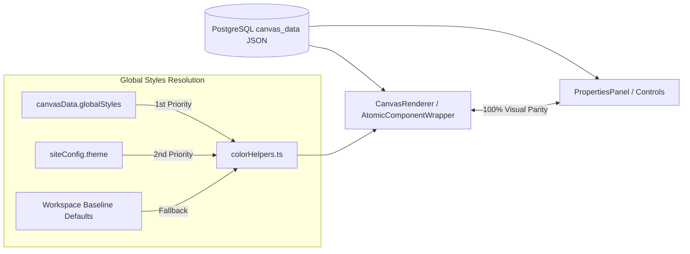

# 📄 Architecture Spec: Page Templates & CanvasData v2.0 Anatomy

> **Scope**: Creation of initial page templates, element factory constructors (`createDefaultSection/Div/Component`), schema `CanvasData v2.0`, `CanvasGlobalStyles` button and typography presets, legacy canvas migration (`migrateCanvas.ts`), and color sanitization (`colorHelpers.ts`).

---

## 1. Scope & Triggers

Read this document when:
- Creating a new page template or modifying initial section structures (`constants.ts`)
- Understanding `CanvasData v2.0` schema to construct or edit canvas JSON manually
- Debugging styling discrepancies between `EditorCanvas` rendering and `PropertiesPanel` values
- Adding global typography or global button preset features (`globalStyles`)

**Key Code Files**:

| File | Purpose / Responsibility |
|---|---|
| `constants.ts` | Factory constructors: `createDefaultSection`, `createDefaultDiv`, `createDefaultComponent` |
| `migrateCanvas.ts` | Initial template generator for new sites + legacy v1 canvas migrator |
| `types.ts` | TypeScript interfaces for `CanvasData`, `CanvasGlobalStyles`, `Section`, `DivComponent`, `AtomicComponent` |
| `colorHelpers.ts` | `sanitizeCanvasColors` & `getThemeTypography` / `getThemeButtonDefaults` style resolution |

---

## 2. Inviolable Directives (ALWAYS / NEVER)

### Element Constructors & JSON Source of Truth
1. **ALWAYS use factory constructors in `constants.ts`**:
   - When building elements programmatically for templates, ALWAYS use `createDefaultSection`, `createDefaultDiv`, or `createDefaultComponent`.
   - **NEVER** instantiate `AtomicComponent` or `DivComponent` objects inline without constructor defaults.
2. **ALWAYS store explicit styles in JSON at element creation**:
   - Both `EditorCanvas` / `CanvasRenderer` and `PropertiesPanel` read directly from element JSON. If a style field (e.g. `color`, `fontSize`, `borderStyle`) is missing in JSON, the panel input will show empty.
3. **ALWAYS use CSS variables and `color-mix(in srgb, ...)` for colors and translucent surfaces**:
   - Primary Brand Color: `var(--brand-gradient-start)`
   - Secondary Brand Color: `var(--brand-gradient-end)`
   - Brand Contrast Color (Text on Brand): `var(--brand-contrast-color)`
   - Surface Borders: `var(--surface-border)`
   - Site Background: `var(--site-bg)`
   - Translucent Cards: `color-mix(in srgb, var(--brand-gradient-start) 4%, var(--site-bg))`
4. **ALWAYS include `globalStyles` in `CanvasData v2.0`**:
   - Store global typography (`headingFont`, `bodyFont`) and button preset templates (`buttonTemplates`) inside `canvasData.globalStyles`.
   - Edits in global styles Settings tab MUST dynamically reflect across all canvas components in real time.
5. **ALWAYS declare `version: '2.0'` in `CanvasData` root**:
   - Without `version: '2.0'`, `migrateLegacyCanvas` will attempt to re-migrate the canvas JSON on every page load.
6. **ALWAYS assign static IDs for anchor sections**:
   - Anchor sections (e.g. Hero `#sec-hero`, FAQ `#sec-faq`, About `#sec-about`) MUST have fixed IDs so scroll buttons (`scrollTargetId`) work deterministically.

### Prohibitions
7. **NEVER hardcode hex colors** (`#FFFFFF`, `#1A1A2E`, `#685aff`, etc.) in template styles. Hardcoding hex colors breaks white-label theme switching.
8. **NEVER hardcode static heights (`height: 40px`) or zeroed padding** in base template styles. Allow atomic components to use native padding and sizing controls.
9. **NEVER hardcode manual destinations on primary CTA buttons**:
   - Primary CTA buttons in templates MUST use `action: 'cta_primary'`, inheriting the page's global destination (`form`, `whatsapp`, `external_url`).
10. **NEVER set section background to `#FFFFFF` color**:
    - Use `background.type: 'none'` so sections inherit `var(--site-bg)`.

---

## 3. Feature Architecture & Visual Parity Flowchart

```
CanvasData (version: '2.0')
  ├── globalStyles?: CanvasGlobalStyles   ← Typography & Button Presets
  ├── navbar?: NavbarConfig               ← Header Configuration
  └── sections: Section[]                 ← Level 1: Full-width Sections
        └── components: Component[]
              ├── DivComponent (type: 'div') ← Level 2: Flex Containers
              │     └── components: Component[]
              │           └── AtomicComponent
              └── AtomicComponent            ← Atomic Leaf Elements
```

### Dynamic Resolution Flow (JSON ↔ Canvas ↔ Properties Panel)



---

## 4. Concrete Code Recipes & Schemas

### Complete Schema: `CanvasData v2.0`

```typescript
export interface CanvasGlobalStyles {
  typography?: {
    headingFont?: string;
    bodyFont?: string;
  };
  buttonTemplates?: Record<string, {
    backgroundColor?: string;
    color?: string;
    borderStyle?: string;
    borderWidth?: string;
    borderColor?: string;
    borderRadius?: string;
    padding?: string;
    fontSize?: string;
    fontWeight?: string;
  }>;
  theme?: {
    primaryColor?: string;
    secondaryColor?: string;
    contrastColor?: string;
    siteBg?: string;
  };
}

export interface CanvasData {
  version: '2.0';
  globalStyles?: CanvasGlobalStyles;
  navbar?: NavbarConfig;
  sections: Section[];
}
```

### Factory Recipe: Creating a CTA Section

```typescript
import { createDefaultSection, createDefaultDiv, createDefaultComponent } from '../constants';

// 1. Create section
const ctaSection = createDefaultSection('Chamada para Ação');
ctaSection.id = 'sec-cta';
ctaSection.layout.alignItems = 'center';
ctaSection.layout.gap = '24px';

// 2. Create inner container div
const contentDiv = createDefaultDiv('Conteúdo CTA');
contentDiv.layout.alignItems = 'center';
contentDiv.layout.maxWidth = '600px';
contentDiv.layout.width = '100%';
contentDiv.layout.gap = '20px';

// 3. Add atomic elements
const heading = createDefaultComponent('heading');
heading.props.text = 'Pronto para começar sua jornada?';
heading.props.level = 2;
heading.style.textAlign = 'center';

const para = createDefaultComponent('paragraph');
para.props.html = '<p>Agende sua primeira sessão e dê o primeiro passo.</p>';
para.style.textAlign = 'center';

const btn = createDefaultComponent('button');
btn.props.label = 'Agendar Agora';
btn.props.variant = 'primary';
btn.props.size = 'lg';
btn.props.action = 'cta_primary';

// 4. Assemble hierarchy
contentDiv.components.push(heading, para, btn);
ctaSection.components.push(contentDiv);

// 5. Push to canvasData
canvasData.sections.push(ctaSection);
```

---

## 5. Anti-Patterns & Prohibitions

### ❌ ERRADO: Instanciar componente sem o construtor de `constants.ts`
```typescript
// NUNCA faça isso: campos de estilo e props obrigatórios ficarão ausentes
const badHeading: AtomicComponent = {
  id: crypto.randomUUID(),
  type: 'heading',
  props: { text: 'Título', level: 2 },
  style: {}, // ❌ Cor e tamanho de fonte faltantes! O painel mostrará vazio.
};
```

### ✅ CORRETO: Usar o construtor factory e customizar props
```typescript
// CORRETO: O construtor garante todos os valores padrão de estilo no JSON
const heading = createDefaultComponent('heading');
heading.props.text = 'Título';
heading.props.level = 2;
```

---

### ❌ ERRADO: Omitir `borderStyle` em cards ou botões outline
```typescript
// NUNCA remova borderStyle — fará com que o BorderControl exiba "none" mesmo com borda visível
delete card.style.borderStyle;
```

### ✅ CORRETO: Manter a especificação explícita de borda no JSON
```typescript
card.style = {
  borderStyle: 'solid',
  borderWidth: '1px',
  borderColor: 'var(--surface-border)',
  borderRadius: '16px',
};
```
