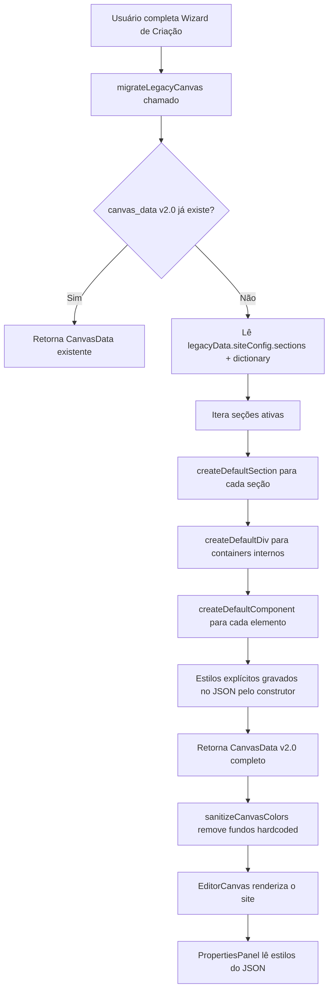
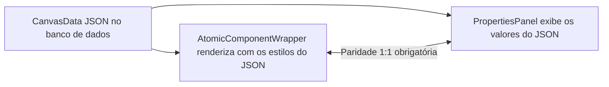

# Page Templates — Criação e Anatomia

## 1. Scope & Triggers

**Leia este arquivo quando você for:**
- Criar um novo template de página de captação
- Adicionar ou modificar a estrutura padrão gerada ao criar um site novo
- Entender como `CanvasData v2.0` é estruturado para codificar templates manualmente em JSON
- Depurar discrepâncias entre o que o canvas renderiza e o que o painel de propriedades exibe

**Arquivos-chave deste domínio:**

| Arquivo | Responsabilidade |
|---|---|
| `constants.ts` | Fábrica de elementos: `createDefaultSection`, `createDefaultDiv`, `createDefaultComponent` |
| `migrateCanvas.ts` | Template padrão gerado para sites novos + migração de canvas legado |
| `types.ts` | TypeScript types de `CanvasData`, `Section`, `DivComponent`, `AtomicComponent` |
| `colorHelpers.ts` | `sanitizeCanvasColors` — limpa cores hardcoded legadas no carregamento |

---

## 2. Inviolable Directives (ALWAYS / NEVER)

### ALWAYS

- **SEMPRE use os construtores de `constants.ts`** ao criar elementos dentro de um template. Nunca monte objetos `AtomicComponent` ou `DivComponent` inline sem usar `createDefaultComponent`, `createDefaultDiv`, ou `createDefaultSection`. Os construtores garantem que todos os estilos obrigatórios estarão presentes no JSON desde a criação.

- **SEMPRE grave estilos explícitos no JSON durante a construção do elemento** (no construtor, em `constants.ts`). A lógica de renderização (`AtomicComponentWrapper`) usa os valores do JSON como fonte de verdade. O painel de propriedades (`PropertiesPanel`) também lê diretamente do JSON — se o campo não existir no JSON, o painel exibirá vazio.

- **SEMPRE use CSS variables** para cores e gradientes em todos os estilos de componentes:
  ```
  var(--brand-gradient-start)    ← Cor primária da marca
  var(--brand-gradient-end)      ← Cor secundária da marca
  var(--brand-contrast-color)    ← Cor de contraste (texto sobre a marca)
  var(--surface-border)          ← Cor de bordas de cards e separadores
  var(--site-bg)                 ← Cor de fundo do site
  ```

- **SEMPRE declare `version: '2.0'`** no objeto raiz `CanvasData`. Sem isso, `migrateLegacyCanvas` tentará re-migrar o canvas a cada carregamento.

- **SEMPRE atribua IDs estáticos** (`section.id`) para seções âncora (ex: `'sec-hero'`, `'sec-faq'`). Botões com `action: 'scroll_to'` referenciam esses IDs em `scrollTargetId`.

- **SEMPRE use `color-mix(in srgb, ...)` com CSS vars** para fundos translúcidos de cards, badges e faq_items:
  ```
  color-mix(in srgb, var(--brand-gradient-start) 4%, var(--site-bg))
  ```

### NEVER

- **NUNCA hardcode cores hexadecimais** (`#FFFFFF`, `#1A1A2E`, etc.) em `style` de seções, divs ou componentes dentro de templates. Quebrará o white-label e o tema dinâmico.

- **NUNCA omita `style.color` em componentes de texto** (`heading`, `paragraph`, `label`, `stat_counter`). Se omitido, o campo "Cor do Texto" no painel ficará vazio e o canvas pode herdar cor errada do container pai.

- **NUNCA omita `style.borderStyle` em componentes com borda** (`card`, `testimonial`, `faq_item`, `button outline`). Se omitido, o `BorderControl` do painel exibirá borda como "none" mesmo que o componente esteja com borda visível na tela.

- **NUNCA grave `background.type: 'color'` com `background.color: '#FFFFFF'`** em seções ou divs do template. Use `background.type: 'none'` e deixe a seção herdar o `siteBg` do canvas container. A função `sanitizeCanvasColors` remove essas cores no carregamento, mas o correto é não gerá-las.

- **NUNCA crie um template sem usar os construtores** — montar objetos JSON manualmente sem `createDefaultSection` ou `createDefaultComponent` pode resultar em campos obrigatórios faltando, causando erros de runtime no editor.

---

## 3. Feature Architecture & Flowchart

### Hierarquia do Canvas v2.0

```
CanvasData (version: '2.0')
  ├── navbar?: NavbarConfig
  └── sections: Section[]                  ← Nível 1: Full-width containers
        └── components: Component[]
              ├── DivComponent (type: 'div') ← Nível 2: Containers internos flexíveis
              │     └── components: Component[]
              │           ├── DivComponent   ← Nível 3 (máximo recomendado)
              │           └── AtomicComponent
              └── AtomicComponent            ← Componente folha sem filhos
```

### Fluxo de Criação de Site Novo



### Fluxo de Renderização vs. Painel



> **Regra de Ouro**: O JSON é a **única fonte de verdade**. Canvas e Painel devem ser espelhos perfeitos do mesmo JSON. Se há divergência, o bug está na criação (construtor), não na renderização.

---

## 4. Concrete Code Recipes & Schemas

### Schema Completo: `CanvasData v2.0`

```typescript
interface CanvasData {
  version: '2.0';           // OBRIGATÓRIO — sem isso, o canvas será re-migrado
  navbar?: NavbarConfig;    // Opcional — configuração do cabeçalho de navegação
  sections: Section[];      // Array de seções (mínimo 1)
}

interface Section {
  id: string;               // Use IDs estáticos para seções âncora (ex: 'sec-hero')
  type: 'section';
  label?: string;           // Nome exibido no painel de camadas
  layout: SectionLayout;    // Flexbox + padding + maxContentWidth
  background: SectionBackground; // type: 'none' | 'color' | 'gradient' | 'image'
  border?: SectionBorder;
  effects?: SectionEffects;
  mobile?: SectionMobileOverride;
  components: Component[];  // DivComponent[] | AtomicComponent[]
  locked?: boolean;
  hidden?: boolean;
}

type Component = DivComponent | AtomicComponent;

interface DivComponent {
  id: string;
  type: 'div';
  label?: string;
  props: Record<string, never>; // Divs não têm props — apenas layout e filhos
  layout: DivLayout;            // Flexbox + dimensões + padding
  background?: DivBackground;
  border?: DivBorder;
  mobile?: DivMobileOverride;
  components: Component[];
}

interface AtomicComponent {
  id: string;
  type: AtomicComponentType;  // 'heading' | 'paragraph' | 'button' | 'card' | ...
  label?: string;
  props: Record<string, any>; // Props específicas por tipo (ver seção de Props)
  style: ComponentStyle;      // Tipografia, cor, espaçamento, borda, fundo
  mobile?: ComponentMobileOverride;
}
```

### Props por Tipo de Componente Atômico

| Tipo | Props principais | Estilos obrigatórios no JSON |
|---|---|---|
| `heading` | `text`, `level` (1-4), `highlightWords` | `color`, `fontSize`, `fontWeight` |
| `paragraph` | `html` (rich text HTML) | `color`, `fontSize`, `lineHeight` |
| `label` | `text`, `htmlTag` | `color`, `fontSize`, `fontWeight` |
| `button` | `label`, `variant`, `size`, `action`, `iconLeft`, `scrollTargetId`, `externalUrl` | `backgroundColor`, `color`, `borderStyle`, `borderRadius` |
| `badge` | `text`, `iconLeft`, `variant`, `rounded` (boolean) | `backgroundColor`, `color`, `borderStyle`, `borderRadius` |
| `card` | `title`, `body`, `iconName`, `iconColor`, `variant`, `titleFontSize`, `titleFontWeight`, `titleColor`, `bodyFontSize`, `bodyColor` | `backgroundColor`, `borderStyle`, `borderWidth`, `borderColor`, `borderRadius` |
| `testimonial` | `quote`, `authorName`, `authorTitle`, `rating` (1-5) | `backgroundColor`, `borderStyle`, `borderWidth`, `borderColor`, `borderRadius` |
| `faq_item` | `question`, `answer`, `defaultOpen`, `questionFontSize`, `questionFontWeight`, `questionColor`, `answerFontSize`, `answerColor` | `backgroundColor`, `borderStyle`, `borderWidth`, `borderColor`, `borderRadius` |
| `stat_counter` | `value`, `label`, `iconName`, `iconColor`, `valueFontSize`, `valueFontWeight`, `valueColor`, `labelFontSize`, `labelColor` | `color`, `textAlign` |
| `icon` | `name`, `size`, `strokeWidth` | `color` |
| `image` | `src`, `alt`, `objectFit`, `aspectRatio` | `width` |
| `list` | `items[]` (`{ text, iconName }`), `listType` (`check`/`bullet`/`number`/`icon`), `iconColor`, `gap` | (nenhum obrigatório) |
| `divider` | `style`, `orientation`, `thickness`, `color` | `marginTop`, `marginBottom` |
| `spacer` | `height`, `mobileHeight` | (nenhum obrigatório) |

### Receita: Criar uma Nova Seção Simples de CTA

```typescript
import { createDefaultSection, createDefaultDiv, createDefaultComponent } from '../constants';

// 1. Criar a seção
const ctaSection = createDefaultSection('Chamada para Ação');
ctaSection.id = 'sec-cta';                    // ID estático para âncoras
ctaSection.layout.alignItems = 'center';
ctaSection.layout.gap = '24px';

// 2. Criar um div container centralizado
const contentDiv = createDefaultDiv('Conteúdo CTA');
contentDiv.layout.alignItems = 'center';
contentDiv.layout.maxWidth = '600px';
contentDiv.layout.width = '100%';
contentDiv.layout.gap = '20px';

// 3. Adicionar componentes atômicos
const heading = createDefaultComponent('heading');
heading.props.text = 'Pronto para começar sua jornada?';
heading.props.level = 2;
heading.style.textAlign = 'center';
// style.color já vem de 'var(--brand-contrast-color)' pelo construtor

const para = createDefaultComponent('paragraph');
para.props.html = '<p>Agende sua primeira sessão e dê o primeiro passo.</p>';
para.style.textAlign = 'center';

const btn = createDefaultComponent('button');
btn.props.label = 'Agendar Agora';
btn.props.variant = 'primary';
btn.props.size = 'lg';
btn.props.action = 'cta_primary';
// backgroundColor, color, borderStyle, borderRadius já vêm do construtor

// 4. Montar a hierarquia
contentDiv.components.push(heading, para, btn);
ctaSection.components.push(contentDiv);

// 5. Adicionar ao CanvasData
canvasData.sections.push(ctaSection);
```

### Receita: Seção em 2 Colunas (Row Layout)

```typescript
const twoColSection = createDefaultSection('Sobre Mim');
twoColSection.id = 'sec-about';
twoColSection.layout.flexDirection = 'row';    // ← Ativa layout horizontal
twoColSection.layout.alignItems = 'center';
twoColSection.layout.gap = '40px';

const leftDiv = createDefaultDiv('Imagem');
leftDiv.layout.flexBasis = '40%';              // ← Ocupa 40% da largura

const img = createDefaultComponent('image');
img.props.src = 'https://...';
img.props.aspectRatio = '3/4';
img.style.borderRadius = '24px';              // OK hardcodar aqui (não é cor)
leftDiv.components.push(img);

const rightDiv = createDefaultDiv('Texto');
rightDiv.layout.flexBasis = '60%';
rightDiv.layout.gap = '16px';

const heading = createDefaultComponent('heading');
heading.props.text = 'Sobre Mim';
heading.props.level = 2;

const para = createDefaultComponent('paragraph');
para.props.html = '<p>Texto descritivo...</p>';

rightDiv.components.push(heading, para);
twoColSection.components.push(leftDiv, rightDiv);
```

### Receita: Grid de Cards (3 Colunas Flex Wrap)

```typescript
const gridSection = createDefaultSection('Especialidades');
gridSection.id = 'sec-cards';

// Div horizontal com wrap para simular grid
const gridDiv = createDefaultDiv('Grid de Cards');
gridDiv.layout.flexDirection = 'row';
gridDiv.layout.flexWrap = 'wrap';
gridDiv.layout.gap = '24px';
gridDiv.layout.width = '100%';
gridDiv.layout.justifyContent = 'center';

const cardData = [
  { title: 'Ansiedade', desc: 'Descrição...' },
  { title: 'Autoestima', desc: 'Descrição...' },
  { title: 'Relacionamentos', desc: 'Descrição...' },
];

for (const data of cardData) {
  const wrapperDiv = createDefaultDiv(data.title);
  wrapperDiv.layout.flexBasis = '30%';       // ~3 por linha em desktop

  const card = createDefaultComponent('card');
  card.props.title = data.title;
  card.props.body = data.desc;
  // backgroundColor, borderStyle, borderWidth, borderColor, borderRadius
  // já vêm do construtor com CSS vars corretas

  wrapperDiv.components.push(card);
  gridDiv.components.push(wrapperDiv);
}

gridSection.components.push(gridDiv);
```

### Mobile Override Pattern

Para adaptar layout em mobile sem duplicar a seção:

```typescript
// Seção em row no desktop → column no mobile
section.mobile = {
  flexDirection: 'column',
  gap: '24px',
};

// Div que ocupa 40% no desktop → 100% no mobile
div.mobile = {
  flexBasis: '100%',
  flexDirection: 'column',
};

// Componente oculto no mobile
component.mobile = {
  hidden: true,
};
```

---

## 5. Anti-Patterns & Prohibitions

### ❌ ERRADO: Montar componente sem usar o construtor

```typescript
// NÃO faça isto — props e estilos obrigatórios podem faltar
const badHeading: AtomicComponent = {
  id: crypto.randomUUID(),
  type: 'heading',
  props: { text: 'Título', level: 2 },
  style: {},  // ← color ausente! Painel mostrará vazio
};
```

### ✅ CORRETO: Usar o construtor e sobrescrever apenas o necessário

```typescript
const heading = createDefaultComponent('heading');  // color já presente no JSON
heading.props.text = 'Título';
heading.props.level = 2;
```

---

### ❌ ERRADO: Hardcodar cor hexadecimal no template

```typescript
card.style.backgroundColor = '#F0F4FF';  // Quebra o white-label e o dark mode
card.style.color = '#1A1A2E';            // NÃO!
```

### ✅ CORRETO: Usar CSS variables

```typescript
// Os construtores já fazem isso automaticamente:
card.style.backgroundColor = 'color-mix(in srgb, var(--brand-gradient-start) 4%, var(--site-bg))';
card.style.color = 'var(--brand-contrast-color)';
```

---

### ❌ ERRADO: Seção com background branco hardcoded

```typescript
section.background = {
  type: 'color',
  color: '#FFFFFF',  // Isso PARECE correto mas causa bug visual no editor
};
```

### ✅ CORRETO: Fundo neutro herda do canvas container

```typescript
section.background = {
  type: 'none',  // A seção herda o siteBg do frame pai do editor
};
// Se precisar de fundo diferente, use CSS vars:
section.background = {
  type: 'color',
  color: 'color-mix(in srgb, var(--brand-gradient-start) 5%, var(--site-bg))',
};
```

---

### ❌ ERRADO: Omitir `borderStyle` em card/testimonial

```typescript
// Se borderStyle não existir no JSON, o BorderControl exibe "none"
// mesmo que o card tenha borda visível (bug de paridade canvas/painel)
const card = createDefaultComponent('card');
delete card.style.borderStyle;  // NÃO remova!
```

### ✅ CORRETO: Todos os campos de borda sempre presentes

```typescript
// O construtor já inclui:
style: {
  borderStyle: 'solid',
  borderWidth: '1px',
  borderColor: 'var(--surface-border)',
  borderRadius: '16px',
}
```

---

### ❌ ERRADO: Criar template sem `version: '2.0'`

```typescript
const canvasData = {
  sections: [ /* ... */ ],
  // version ausente → migrateLegacyCanvas tenta re-migrar no próximo load
};
```

### ✅ CORRETO: Sempre declarar a versão

```typescript
const canvasData: CanvasData = {
  version: '2.0',
  sections: [ /* ... */ ],
};
```
