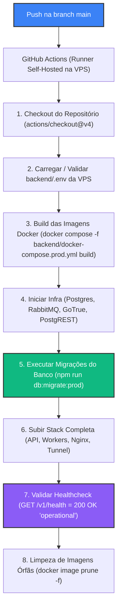

# 🚀 Production Deployment Architecture & CI/CD Pipeline (VPS Self-Hosted Runner)

> **Scope & Triggers**: Leia este arquivo ao configurar a VPS de produção, gerenciar o Docker Compose de produção (`docker-compose.prod.yml`), atualizar o workflow do GitHub Actions (`.github/workflows/deploy.yml`) ou solucionar problemas de migração e healthcheck em ambiente de produção.

---

## ⚡ 1. Directives & Constraints (ALWAYS / NEVER)

- **ALWAYS execute DB migrations via `npm run db:migrate:prod` before updating application containers**: As migrações do banco de dados devem ser aplicadas contra o PostgreSQL de produção antes de colocar a nova versão da API e dos Workers no ar.
- **NEVER mount host code volumes in production (`.:/usr/src/app`)**: O ambiente de produção consome código pré-compilado em JavaScript (`dist/`) empacotado na imagem Docker via multi-stage build.
- **ALWAYS restrict administrative/database ports to localhost on the VPS**: Portas do PostgreSQL (`5432`) e RabbitMQ (`5672`, `15672`) devem permanecer vinculadas a `127.0.0.1` e não expostas diretamente para a internet aberta.
- **ALWAYS enforce log rotation in Docker Compose**: Todos os serviços em `docker-compose.prod.yml` devem declarar `logging` com `max-size: "10m"` e `max-file: "3"` para evitar esgotamento de disco na VPS.
- **NEVER store production secrets in git or workflow files**: Variáveis de ambiente como `JWT_SECRET`, `POSTGRES_PASSWORD`, `SERVICE_SECRET_KEY` e `TUNNEL_TOKEN` pertencem exclusivamente ao arquivo `backend/.env` na VPS.

---

## 🗺️ 2. Deployment Architecture & CI/CD Flowchart



---

## 🏗️ 3. Environment & Stack Services Overview

| Serviço | Nome do Container | Porta Exposta | Função |
|---|---|---|---|
| **PostgreSQL** | `psi-postgres-prod` | `127.0.0.1:5432` | Banco relacional principal com schemas `public` e `auth`. |
| **GoTrue Auth** | `psi-gotrue-prod` | Interna (`gotrue:9999`) | Servidor Supabase Auth para autenticação e tokens JWT. |
| **PostgREST** | `psi-postgrest-prod` | Interna (`postgrest:3000`) | API REST auto-gerada sobre `public` com RLS. |
| **RabbitMQ** | `psi-rabbitmq-prod` | `127.0.0.1:5672 / 15672` | Broker AMQP para mensageria assíncrona e logs. |
| **Fastify API** | `psi-api-prod` | Interna (`api:5000`) | API Core para uploads, webhooks e cookies HttpOnly. |
| **TS Workers** | `psi-workers-prod` | Interna | Consumidores de fila RabbitMQ em segundo plano. |
| **Nginx Gateway** | `psi-nginx-prod` | Host `:8000` (ou `:80`) | Proxy reverso e roteador central do sistema. |
| **Cloudflare Tunnel** | `psi-tunnel-prod` | Egress Tunnel | Conexão criptografada de saída para expor o Nginx com SSL. |

---

## 📖 4. Concrete Code Recipes & CLI Commands

### Executar Deploy Manual em Produção
```bash
cd backend
docker compose -f docker-compose.prod.yml build
docker compose -f docker-compose.prod.yml up -d postgres rabbitmq gotrue postgrest
docker compose -f docker-compose.prod.yml run --rm api npm run db:migrate:prod
docker compose -f docker-compose.prod.yml up -d --remove-orphans
```

### Verificar Logs de Produção com Rotação
```bash
cd backend
docker compose -f docker-compose.prod.yml logs -f --tail=100 api workers
```

---

## ❌ 5. Anti-Patterns & Prohibitions

### ❌ ERRADO: Usar `docker-compose.yml` de desenvolvimento em produção com bind mount de código
```yaml
# ❌ NÃO FAÇA ISSO EM PRODUÇÃO: Sobrescreve a imagem compila com arquivos locais da VPS
volumes:
  - .:/usr/src/app
```

### ✅ CORRETO: Usar `docker-compose.prod.yml` sem bind mounts e com código embarcado na imagem
```yaml
# ✅ FAÇA ISSO: A imagem roda o código compilado em JS sem mapeamento de volume
api:
  build:
    context: .
    dockerfile: Dockerfile
  command: npm run start:api
```
