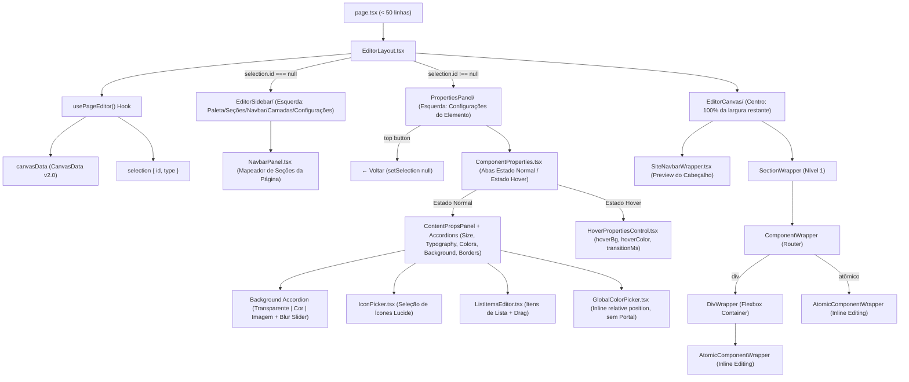

# 🖥️ Architecture Spec: Visual Site Editor (Blueprint v2.0 — Elementor Flex-box)

> **Scope**: Canvas rendering, drag-and-drop section & div containers, atomic components, properties panel, mobile overrides, navbar section mapping, global styles live reactivity, and published site visual parity.

---

## 1. Scope & Triggers

Read this document when working on:
- Site Visual Editor (`frontend/apps/web/src/app/dashboard/captacao/[pageId]/`)
- Canvas components (`_editor/EditorCanvas/`, `_editor/EditorSidebar/`, `_editor/PropertiesPanel/`)
- Canvas data schemas (`CanvasData`, `CanvasGlobalStyles`, `Section`, `DivComponent`, `AtomicComponent`, `NavbarConfig`)
- Canvas state hooks (`usePageEditor.ts`, `useEditorHistory.ts`, `useAutoSave.ts`, `useDragAndDrop.ts`)
- Canvas renderers in sites app (`frontend/apps/sites/src/components/CanvasRenderer/`)

---

## 2. Inviolable Directives (ALWAYS / NEVER)

### Architecture & Data Flow
1. **ALWAYS enforce strict 2-level hierarchy limits**:
   - `Canvas` → `Section[]` (Nível 1 EXCLUSIVO) → `Component[]` (Divs e Atômicos) → `AtomicComponent[]` (Dentro do Div).
   - **NEVER** nest a `Section` inside another `Section`.
   - **NEVER** nest a `Section` inside a `Div`.
   - **NEVER** nest a `Div` inside another `Div` (max depth = 1).
2. **ALWAYS store and reactively apply `globalStyles` in `CanvasData v2.0`**:
   - `CanvasData` contains `globalStyles?: CanvasGlobalStyles` (`typography`, `buttonTemplates`, `theme`).
   - When global styles are modified in settings or canvas JSON, the editor and canvas MUST dynamically update without a full page reload.
3. **ALWAYS mutate canvas state immutably**:
   - Use dedicated helpers in `_editor/utils/canvasHelpers.ts` (`addSection`, `removeSection`, `moveSection`, `updateSection`, `addComponentToParent`, `removeComponentFromCanvas`, `updateComponentInCanvas`).
4. **ALWAYS debounce database save operations by 1,500ms**:
   - Save updates to `capture_pages.draft_data` via `useAutoSave.ts` debounced by 1,500ms (preserving `canvas_data` strictly for published live sites).

### UI/UX & Properties Panel
5. **ALWAYS render element properties on the LEFT SIDEBAR (Elementor UX) with a 2-Tab system (Normal vs Hover)**:
   - When an element is selected (`selection.id !== null`), the left sidebar switches to show `<PropertiesPanel />` with a top header containing `← Voltar`, component type badge, and an instant **Visibilidade toggle button** (`Eye`/`EyeOff`).
   - `<ComponentProperties />` provides an explicit **State Selector Tab**:
     - **Estado Normal**: Accordions for Content (`ContentPropsPanel.tsx`), Dimensions & Sizing (`SizeControl` + `Align Self`), Typography (`GlobalTypographyPicker`), Colors (`GlobalColorPicker`), Background (transparent, solid color, image + `backdrop-blur` slider), Borders (`BorderControl`), and Effects.
     - **Estado Hover**: Panel `<HoverPropertiesControl />` for interactive mouse hover states (`hoverBackgroundColor`, `hoverColor`, `hoverBorderColor`, `hoverOpacity`, `hoverScale`, `hoverEffect`) and transition speed in ms (`transitionDurationMs`, `transitionTimingFunction`).
   - When no element is selected (`selection.id === null`), the left sidebar shows `<EditorSidebar />` (Palette/Sections/Navbar/Layers/Settings) and the central canvas occupies 100% of remaining width.
6. **ALWAYS provide intuitive Background Styling options inside the Background Accordion**:
   - Inside the sidebar Background accordion, provide a mode selector: `Transparente` (`type: 'none'`), `Cor Única` (`type: 'color'`), and `Imagem` (`type: 'image'`).
   - Include a **Background Blur** slider (`backdropBlur` from `0px` to `24px`) for frost glass effects on containers.
7. **ALWAYS support Inline Text Editing directly on the Canvas**:
   - Text elements (`heading`, `paragraph`, `label`, `button`, `badge`, `card`, `faq_item`, `testimonial`, `stat_counter`) support `contentEditable={isSelected}` so users can type and edit text directly on the visual page.
   - Text selection is protected from canvas auto-cancellation via event propagation control and `window.getSelection()`.
8. **ALWAYS use zero-layout-impact outlines (`outline` with `-outline-offset-2`) for hover and selection**:
   - **NEVER** add `px-1` or conditional padding to text elements when selected/editable.
   - **NEVER** toggle element `border` widths on hover/selection; use CSS `outline` with negative offsets (`-outline-offset-2`) so element dimensions stay 100% stable without layout shifts.
9. **ALWAYS use Contextual Mobile Overrides UX when viewportMode is 'mobile'**:
   - When viewportMode is `'mobile'`, editing element properties (sizing, layout, visibility, alignment) MUST write to `element.mobile` instead of overwriting desktop base values.
   - Visibility is toggled via a single "Visibilidade" button (`Eye`/`EyeOff`) in the sidebar header, which sets `element.mobile.hidden` when in mobile view.
10. **ALWAYS render popovers and color pickers relative to parent input container**:
    - **NEVER** use `createPortal` to `document.body` for sidebar pickers (`GlobalColorPicker`). Portal fixed positioning detaches from the sidebar on scroll.
    - Render popovers inline inside `relative` trigger containers using `absolute left-0 top-full mt-1.5 z-50` so they scroll attached to the sidebar.
11. **ALWAYS keep `page.tsx` concise (< 50 lines)**:
    - `page.tsx` acts purely as a shell delegating execution to `EditorLayout` in `_editor/`.
12. **ALWAYS enforce Strict Scope Rules for Editor Element Hovering & Selection**:
    - **Child Element Focus**: Moving the mouse over a child element (text, button, image) MUST highlight strictly that child element (`isSelfHovered = true`), displaying its blue hover frame.
    - **Container/Section Vacant Space Focus**: Moving the mouse over vacant space inside a Container Div or Section (padding, gap, empty area) MUST highlight that Container Div or Section (`isSelfHovered = true`), displaying its purple hover frame.
    - **Selection**: Clicking on vacant space or padding inside a Container or Section MUST select that Container or Section.
    - **Event Propagation Standard**: All canvas element wrappers (`SectionWrapper`, `DivWrapper`, `AtomicComponentWrapper`, `CarouselWrapper`) MUST use `onMouseOver` with `e.stopPropagation()` calling `onHover(id)` to guarantee instant hover re-engagement when moving off children into container/section padding/gaps.
13. **ALWAYS enforce Canvas Viewport Scope for Global Sticky Containers (`stickyScope: 'page'`)**:
    - Sticky elements configured with `stickyScope: 'page'` MUST anchor relative to the **Canvas Viewport container** (`@psi/canvas-renderer`) and NEVER overflow or escape into the host Editor page shell (`apps/web` topbar header or left sidebar).
    - Use containment and position isolation on the Canvas scroll container to confine sticky/fixed elements within the site boundaries without breaking vertical scrolling (avoiding `contain: paint` on scroll wrappers).
14. **ALWAYS render Section Items as Drag & Drop Cards in the Sidebar Palette**:
    - **NEVER** use static, click-only template blocks for sections. All section structures (1 Coluna, 2 Colunas, 3 Colunas, Header Clássico, Header Flutuante, Rodapé) MUST be rendered inside the `AddPalette` grid as draggable cards (`draggable`, `onDragStart`, `GripVertical`), sharing identical drag-and-drop parity with atomic components.
    - Dragging a section item onto any section or canvas viewport creates and places the section instantly via `createSectionFromPreset(item.preset)`.
15. **ALWAYS Hoist Global Sticky Containers (`stickyScope: 'page'`) to Canvas Root Layer**:
    - **NEVER** keep `stickyScope: 'page'` containers trapped inside parent `<section>` DOM wrappers. In CSS, sticky elements cannot stick beyond their direct parent's bounding box height, causing nested containers to hide when scrolling past their parent section.
    - **ALWAYS** hoist `stickyScope: 'page'` containers to the **Canvas Root Layer** (`<CanvasRenderer>`) with `isHoistedRoot={true}`. This binds the sticky parent to the full Canvas Viewport height, ensuring smooth, native sticky behavior across 100% of all page sections.
    - Center global sticky elements using `marginLeft: 'auto'`, `marginRight: 'auto'`, `width: '100%'`, `maxWidth: '1200px'` without `left: 50%` or `transform: translateX(-50%)`.


---

## 3. Feature Architecture & UI/UX Design System



---

## 4. Concrete Code Recipes & Schemas

### Canvas Data Schema (`CanvasData v2.0`)

```typescript
export interface CanvasGlobalStyles {
  typography?: {
    headingFont?: string;
    bodyFont?: string;
  };
  buttonTemplates?: Record<string, {
    backgroundColor?: string;
    color?: string;
    borderStyle?: string;
    borderWidth?: string;
    borderColor?: string;
    borderRadius?: string;
    padding?: string;
    fontSize?: string;
    fontWeight?: string;
  }>;
  theme?: {
    primaryColor?: string;
    secondaryColor?: string;
    contrastColor?: string;
    siteBg?: string;
  };
}

export interface NavbarLink {
  id: string;
  label: string;
  targetType: 'section' | 'external_url';
  sectionId?: string;
  externalUrl?: string;
}

export interface NavbarConfig {
  enabled: boolean;
  logoMode: 'workspace' | 'custom_text' | 'custom_image';
  customText?: string;
  customImageUrl?: string;
  sticky: boolean;
  links: NavbarLink[];
  showCtaButton: boolean;
  ctaButtonText?: string;
  ctaButtonAction?: 'cta_primary' | 'whatsapp' | 'external_url';
}

export interface CanvasData {
  version: '2.0';
  globalStyles?: CanvasGlobalStyles;
  navbar?: NavbarConfig;
  sections: Section[];
}
```

### Background Accordion State Definition

```typescript
export interface SectionBackground {
  type: 'none' | 'color' | 'gradient' | 'image';
  color?: string;
  gradient?: string;
  imageUrl?: string;
  imagePosition?: string;
  imageSize?: 'cover' | 'contain' | 'auto';
  imageOpacity?: number;
  backdropBlur?: string; // e.g. '0px', '8px', '16px'
}
```

---

## 5. Anti-Patterns & Prohibitions

### ❌ ERRADO: Alterar o border/padding de um elemento no hover ou seleção
```tsx
// NUNCA faça isso: adiciona borda de 2px no clique, deslocando todo o layout da página
<div style={{ border: isSelected ? '2px solid #685aff' : 'none' }}>
```

### ✅ CORRETO: Usar `outline` com offset negativo (`-outline-offset-2`)
```tsx
// CORRETO: outline não ocupa espaço no box model e mantém o layout 100% estável
<div style={{ outline: isSelected ? '2px solid var(--brand-gradient-start)' : undefined, outlineOffset: '-2px' }}>
```

---

### ❌ ERRADO: Renderizar o GlobalColorPicker com `createPortal` para `document.body`
```tsx
// NUNCA use Portal para pickers na sidebar — ao rolar a barra lateral, o picker fica flutuando descolado
createPortal(<HexColorPicker />, document.body);
```

### ✅ CORRETO: Posicionar o picker inline de forma relativa
```tsx
// CORRETO: O picker rola perfeitamente junto com o conteúdo da sidebar
<div className="relative">
  <button onClick={togglePicker}>Cor</button>
  {isOpen && (
    <div className="absolute left-0 top-full mt-1.5 z-50 shadow-xl rounded-xl border border-neutral-700 bg-neutral-900 p-3">
      <HexColorPicker color={color} onChange={onChange} />
    </div>
  )}
</div>
```

---

### ❌ ERRADO: Misturar CSS shorthand (`background`) com longhands (`backgroundImage`)
```typescript
// NUNCA misture background com backgroundImage em objetos de estilo React
element.style = {
  background: '#ffffff',
  backgroundImage: 'url(...)', // Causará conflitos de sobrescrita imprevisíveis
};
```

### ✅ CORRETO: Usar propriedades explicitamente separadas
```typescript
element.style = {
  backgroundColor: 'var(--site-bg)',
  backgroundImage: 'url(...)',
  backgroundSize: 'cover',
};
```

---

### ❌ ERRADO: Permitir que elementos com Sticky Global vazem para a página do Editor
```tsx
// NUNCA permita que a ancoragem de stickyScope: 'page' tome como referência a janela/documento do Editor
// Isso faz o container sticky flutuar por cima do Topbar e da Sidebar do Editor!
<div style={{ position: 'fixed', top: 0, zIndex: 9999 }}>...</div>
```

### ✅ CORRETO: Restringir o escopo sticky global ao Viewport do Canvas
```tsx
// CORRETO: O escopo global 'page' refere-se estritamente ao topo do Canvas (área de renderização do site)
// O viewport do Canvas mantém isolamento de contexto para manter o elemento preso dentro da área do site
<div className="flex-1 overflow-y-auto relative w-full" style={{ isolation: 'isolate' }}>
  {/* Sticky 'page' alinha-se ao topo deste container de rolamento do Canvas */}
</div>
```

