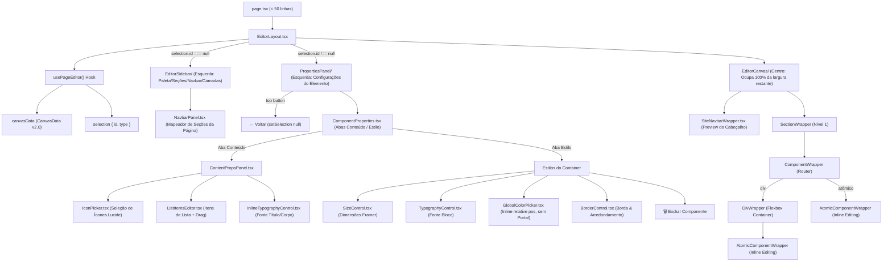

# 🖥️ Architecture Spec: Visual Site Editor (Blueprint v2.0 — Elementor Flex-box)

> **Scope**: Canvas rendering, drag-and-drop section & div containers, atomic components, properties panel, mobile overrides, navbar section mapping & live preview.

---

## 1. Scope & Triggers

Read this document when working on:
- Site Visual Editor (`frontend/apps/web/src/app/dashboard/captacao/[pageId]/`)
- Canvas components (`_editor/EditorCanvas/`, `_editor/EditorSidebar/`, `_editor/PropertiesPanel/`)
- Canvas data schemas (`CanvasData`, `Section`, `DivComponent`, `AtomicComponent`, `NavbarConfig`)
- Canvas state hooks (`usePageEditor.ts`, `useEditorHistory.ts`, `useAutoSave.ts`, `useDragAndDrop.ts`)
- Canvas renderers in sites app (`frontend/apps/sites/src/components/v2/`)

---

## 2. Inviolable Directives (ALWAYS / NEVER)

1. **ALWAYS enforce strict 2-level hierarchy limits**:
   - `Canvas` → `Section[]` (Nível 1 EXCLUSIVO) → `Component[]` (Divs e Atômicos) → `AtomicComponent[]` (Dentro do Div).
   - **NEVER** nest a `Section` inside another `Section`.
   - **NEVER** nest a `Section` inside a `Div`.
   - **NEVER** nest a `Div` inside another `Div` (max depth = 1).
2. **ALWAYS render element properties on the LEFT SIDEBAR (Elementor UX) with a 2-Tab system (Conteúdo / Estilo)**:
   - When an element is selected (`selection.id !== null`), the left sidebar switches to show `<PropertiesPanel />` with a top `← Voltar` button.
   - For atomic/composite components with internal props (`card`, `faq_item`, `stat_counter`, `list`, `badge`, `button`, etc.), `<ComponentProperties />` provides a **2-Tab system**:
     - **Aba Conteúdo** (`ContentPropsPanel.tsx`): Text inputs, Lucide icons (`IconPicker`), array item lists (`ListItemsEditor`), and internal sub-element typography (`InlineTypographyControl` for card title/body, FAQ question/answer, counter value/label).
     - **Aba Estilo**: External container properties (visibility `Eye`/`EyeOff`, `SizeControl`, external container `TypographyControl`, `GlobalColorPicker`, `BorderControl`, `alignSelf`, delete button).
   - When no element is selected (`selection.id === null`), the left sidebar shows `<EditorSidebar />` (Palette/Sections/Navbar/Layers) and the central canvas occupies 100% of remaining width.
3. **ALWAYS support Inline Text Editing directly on the Canvas**:
   - Text elements (`heading`, `paragraph`, `label`, `button`, `badge`, `card`, `faq_item`, `testimonial`, `stat_counter`) support `contentEditable={isSelected}` so users can type and edit text directly on the visual page.
4. **ALWAYS manage Site Navbar configuration in `<NavbarPanel />`**:
   - The site header settings reside in `CanvasData.navbar` (`NavbarConfig`).
   - Page sections in `canvasData.sections` are mapped to navigation links (`#sec-id`) via `NavbarPanel.tsx` in `EditorSidebar`.
5. **ALWAYS keep `page.tsx` concise (< 50 lines)**:
   - `page.tsx` acts purely as a shell delegating execution to `EditorLayout` in `_editor/`.
6. **ALWAYS mutate canvas state immutably**:
   - Use helpers in `_editor/utils/canvasHelpers.ts` (`addSection`, `removeSection`, `moveSection`, `updateSection`, `addComponentToParent`, `removeComponentFromCanvas`, `updateComponentInCanvas`).
7. **ALWAYS provide a prominent delete button with children**:
   - Every properties panel MUST include a clear "Excluir [Elemento] e todos os filhos" button that removes the node and all nested children recursively.
8. **ALWAYS debounce database save operations by 1,500ms**:
   - Save updates to `capture_pages.canvas_data` via `useAutoSave.ts` debounced by 1,500ms.
9. **ALWAYS support full alignment controls (justification, cross-alignment, block position & text alignment)**:
   - Sections and Divs support flex justification (`justifyContent`), cross alignment (`alignItems`), and inherited text alignment (`textAlign`).
   - Div containers and Atomic components support block position alignment in parent containers (`alignSelf`) and text alignment (`left`, `center`, `right`, `justify`).
10. **ALWAYS use zero-layout-impact outlines (`outline` with `-outline-offset-2`) for hover and selection**:
    - **NEVER** add `px-1` or conditional padding to text elements when selected/editable.
    - **NEVER** toggle element `border` widths on hover/selection; use CSS `outline` with negative offsets (`-outline-offset-2`) so element dimensions stay 100% stable without layout shifts.
11. **ALWAYS consume platform default colors, fonts, and BrandLogo component**:
    - Navbar and atomic logo elements MUST use `<BrandLogo />` from `@psi/ui`.
    - Follow standard logo fallback priority: Logo Image → Icon + Title Text → HTML Badge (Ψ) + Title Text.
    - Inject `--brand-gradient-start`, `--brand-gradient-end`, and `--brand-contrast-color` CSS custom properties dynamically into the canvas container.
12. **ALWAYS use Framer-Style Size & Layout controls with icon-driven UI**:
    - Provide intuitive mode selection (`Fixed`, `Relative`, `Fill`, `Fit Content`) for Width and Height.
    - Use representative icons (`MoveHorizontal`, `MoveVertical`, `Maximize`, `Minimize`, `Lock`, `Eye`, `EyeOff`, etc.) instead of text buttons for layout direction and alignment.
    - Support Aspect Ratio and Object Fit controls on Image components and SizeControl.
13. **ALWAYS use Contextual Mobile Overrides UX when viewportMode is 'mobile'**:
    - When viewportMode is `'mobile'`, editing element properties (sizing, layout, visibility, alignment) MUST write to `element.mobile` instead of overwriting desktop base values.
    - Visibility is toggled via a single "Visibilidade / Ocultar" button (`Eye`/`EyeOff`), which sets `element.mobile.hidden` when in mobile view.
14. **ALWAYS render popovers and color pickers relative to parent input container**:
    - **NEVER** use `createPortal` to `document.body` for sidebar pickers (`GlobalColorPicker`). Portal fixed positioning detaches from the sidebar on scroll.
    - Render popovers inline inside `relative` trigger containers using `absolute left-0 top-full mt-1.5 z-50` so they scroll 100% attached to the sidebar.
    - **NEVER** mix shorthand CSS properties (`background`) with longhand properties (`backgroundImage`, `backgroundSize`). Use separate explicit longhands (`backgroundColor`, `backgroundImage`) to prevent React re-render conflicts.

---

## 3. Feature Architecture & Flowchart



---

## 4. Concrete Code Recipes & Schemas

### Canvas Data Schema (`CanvasData v2.0`)

```typescript
export interface NavbarLink {
  id: string;
  label: string;
  targetType: 'section' | 'external_url';
  sectionId?: string;
  externalUrl?: string;
}

export interface NavbarConfig {
  enabled: boolean;
  logoMode: 'workspace' | 'custom_text' | 'custom_image';
  customText?: string;
  customImageUrl?: string;
  sticky: boolean;
  links: NavbarLink[];
  showCtaButton: boolean;
  ctaButtonText?: string;
  ctaButtonAction?: 'cta_primary' | 'whatsapp' | 'external_url';
}

export interface CanvasData {
  version: '2.0';
  navbar?: NavbarConfig;
  sections: Section[];
}
```

---

## 5. Anti-Patterns & Prohibitions

❌ **WRONG**: Hardcoding navbar menu items as fixed static links.
> Why it fails: Page sections dynamic labels and IDs would get out of sync with the header navigation.

✅ **CORRECT**: Dynamically mapping `canvasData.sections` to `NavbarLink[]` with anchor targets `#sec-id` and updating links automatically when section labels change.
