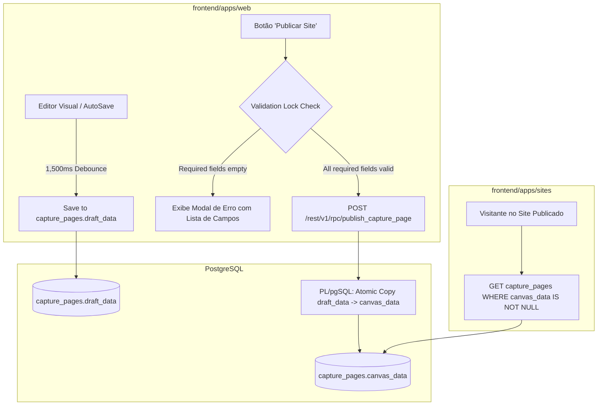

# 🌐 Architecture Spec: Drafts, Staging & Subdomain Publishing

> **Scope**: Site draft states (`draft_data`), live published content (`canvas_data`), publication validation lock, atomic publishing RPCs, staging subdomains, and Cloudflare DNS integration.

---

## 1. Scope & Triggers

Read this document when:
- Implementing or modifying site auto-save (`useAutoSave.ts`) or publishing handlers (`publishCapturePage`)
- Working on draft vs. live site isolation in `capture_pages` table
- Debugging validation locks on page publication (e.g. empty required text fields)
- Configuring subdomain resolution (`<subdomain>.psi.app`) or custom domain routing

---

## 2. Inviolable Directives (ALWAYS / NEVER)

### State Isolation (Draft vs Live Published)
1. **ALWAYS strictly isolate Draft state from Live Published state**:
   - Modifications made in the Visual Site Editor ONLY touch draft storage (`capture_pages.draft_data` or `site_drafts.draft_content`).
   - The live public site served at `subdomain.psi.app/slug` ONLY reads content from `capture_pages.canvas_data` (published state).
   - Visitors on published sites NEVER see work-in-progress edits until the user explicitly clicks **Publicar Alterações**.
2. **ALWAYS enforce Publication Validation Lock on empty required text fields**:
   - Page publication (`publishCapturePage`) MUST be blocked if any active section (`hero`, `about`, `diagnostic`, `process`, `space`, `faq`) contains empty required text fields in `dictionary` or `canvasData`.
   - If validation fails, render a clear UI notification listing the missing fields with direct links to fix them in the editor.
3. **ALWAYS execute atomic RPC transactions for page publication**:
   - Page publication MUST use an atomic PL/pgSQL RPC Stored Function (`publish_capture_page`) that copies `draft_data` into `canvas_data`, sets `is_published = true`, and updates `published_at = now()` in a single atomic DB transaction.

### Subdomain & Domain Resolution
4. **Subdomains belong to the Workspace**:
   - Subdomains (`<subdomain>.psi.app`) map via Nginx / Cloudflare to query `capture_pages` joined with `workspaces` by `workspace_id`.
   - Path-based routing handles page slugs (e.g. `/` for primary landing page, `/ansiedade` for specific funnel page).

---

## 3. Feature Architecture & UI/UX Design System



### Publishing Modal UI/UX Workflow

1. **User Clicks 'Publicar Alterações'**: Prominent button in editor header bar.
2. **Pre-flight Validation Scan**: The client checks all active sections for missing title, CRP, or body text.
3. **Modal Confirmation**:
   - If valid: Shows preview link (`subdomain.psi.app/slug`), timestamp of last publication, and single primary button **"Confirmar Publicação"**.
   - If invalid: Displays an Alert Warning box listing unfilled required fields with direct navigation anchors.

---

## 4. Concrete Code Recipes & Schemas

### Database Table Schema (`public.capture_pages`)

```sql
ALTER TABLE public.capture_pages
  ADD COLUMN IF NOT EXISTS draft_data JSONB DEFAULT '{}'::jsonb,
  ADD COLUMN IF NOT EXISTS canvas_data JSONB DEFAULT '{}'::jsonb,
  ADD COLUMN IF NOT EXISTS is_published BOOLEAN DEFAULT false,
  ADD COLUMN IF NOT EXISTS published_at TIMESTAMPTZ;
```

### Atomic Publication RPC Function (`publish_capture_page`)

```sql
CREATE OR REPLACE FUNCTION public.publish_capture_page(p_page_id UUID)
RETURNS JSONB
LANGUAGE plpgsql
SECURITY DEFINER
AS $$
DECLARE
  v_workspace_id UUID;
  v_result JSONB;
BEGIN
  -- Get user workspace from auth JWT
  v_workspace_id := (auth.jwt() ->> 'sub')::UUID;

  UPDATE public.capture_pages
  SET 
    canvas_data = draft_data,
    is_published = true,
    published_at = now(),
    updated_at = now()
  WHERE id = p_page_id;

  IF NOT FOUND THEN
    RAISE EXCEPTION 'Página de captação não encontrada ou sem permissão.';
  END IF;

  RETURN jsonb_build_object('success', true, 'published_at', now());
END;
$$;
```

---

## 5. Anti-Patterns & Prohibitions

### ❌ ERRADO: Gravar edições do editor diretamente na coluna `canvas_data`
```typescript
// NUNCA faça isso: sobrescreve o site público ao vivo enquanto o usuário digita no editor
await supabase.from('capture_pages').update({ canvas_data: newCanvasData }).eq('id', pageId);
```

### ✅ CORRETO: Gravar edições no rascunho (`draft_data`) e copiar para `canvas_data` apenas na publicação
```typescript
// CORRETO: O editor altera apenas o rascunho; o site ao vivo permanece seguro
await supabase.from('capture_pages').update({ draft_data: newCanvasData }).eq('id', pageId);
```

---

### ❌ ERRADO: Ignorar campos obrigatórios vazios e publicar site incompleto
```typescript
// NUNCA publique sem validar campos de texto obrigatórios (Hero, Título, CRP)
const publishDirectly = async () => {
  await api.rpc('publish_capture_page', { p_page_id: pageId }); // ❌ Site publicado com textos vazios!
};
```

### ✅ CORRETO: Executar pré-validação antes da chamada RPC
```typescript
// CORRETO: Bloqueia publicação se houver campos obrigatórios vazios
const handlePublish = async () => {
  const missingFields = validateRequiredFields(page.draftData);
  if (missingFields.length > 0) {
    setValidationErrors(missingFields);
    setShowValidationModal(true);
    return;
  }

  await api.rpc('publish_capture_page', { p_page_id: pageId });
  toast.success('Site publicado com sucesso!');
};
```
