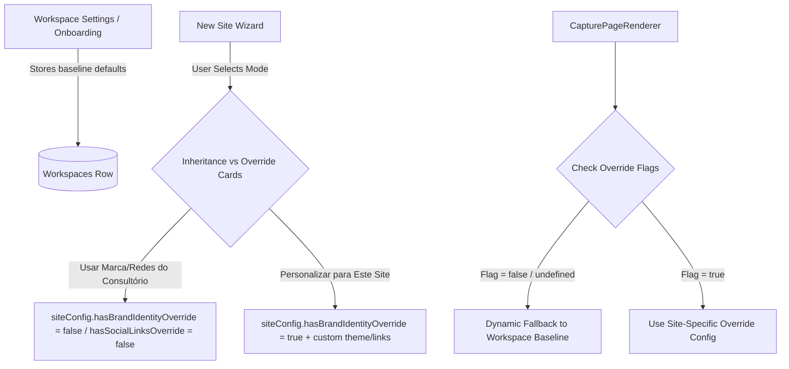

# 🧙‍♂️ Architecture Spec: Universal Workspace Inheritance & Site Overrides

> **Scope**: Multi-step workspace onboarding wizard, site creation wizard, RPC workspace bootstrapping, default CRM columns, visual identity initialization, and universal inheritance & override pattern (Branding, Social Links, Professional Profile).

---

## 1. Scope & Triggers

Read this document when working on:
- Workspace onboarding wizard (`frontend/apps/web/src/app/dashboard/onboarding/page.tsx`)
- New site creation wizard (`frontend/apps/web/src/app/dashboard/captacao/nova/page.tsx`)
- Workspace settings forms (`frontend/apps/web/src/app/dashboard/configuracoes/workspace-settings-form.tsx`)
- Site renderer fallback logic (`frontend/apps/sites/src/components/CapturePageRenderer.tsx`)
- Database schema changes to workspace defaults or site config overrides

---

## 2. Inviolable Directives (ALWAYS / NEVER)

1. **ALWAYS Use Universal Workspace Inheritance by Default**:
   - Workspaces store baseline defaults for **Identidade Visual** (`visual_identities` table e `workspaces.gradient_color_start`, `gradient_color_end`, `contrast_color`, `bg_dark_color`), **Redes Sociais & Links** (`social_links`), e **Perfil Profissional** (`name`, `crp`, `bio`).
   - The site creation wizard (`nova/page.tsx`), site editor and site renderer MUST fetch and render the exact colors saved in the active workspace database. Sites MUST dynamically inherit workspace defaults whenever the corresponding override flag (`hasBrandIdentityOverride`, `hasSocialLinksOverride`, `hasProfileOverride`) is `false`, `null`, or `undefined`.
2. **DOMAINS ARE ALWAYS WORKSPACE-GLOBAL (NO SITE OVERRIDES)**:
   - Subdomains (`workspaces.subdomain`) and custom domains (`workspaces.custom_domain`) belong exclusively to the workspace as a whole.
   - Sites NEVER override the base domain; they only specify their URL path/slug (e.g. `/`, `/ansiedade`).
3. **ONLY Create Site Overrides when Explicitly Requested by User**:
   - Set override flags (`hasBrandIdentityOverride = true`, `hasSocialLinksOverride = true`) ONLY when the user explicitly chooses "Personalizar para Este Site" in the wizard or editor.
   - Do NOT duplicate workspace defaults into `siteConfig` when inheritance is active. This guarantees that future edits in Workspace Settings automatically cascade to all non-overridden sites.
4. **ALWAYS Follow the Initial Template Inheritance Chain for New Sites**:
   - When creating a new site in a workspace:
     - **1st Priority (Workspace Inheritance)**: Inherit `dictionary`, `siteConfig` text structure, and `formFlow` from the **most recently updated site** of the same workspace.
     - **2nd Priority (Platform Global Fallback)**: If the workspace has NO previous sites (first site of workspace), inherit the **platform global default template model** (`DEFAULT_TEMPLATE_MODEL`).
5. **NEVER Inject Hidden Text Fallbacks in Production Rendering**:
   - `CapturePageRenderer.tsx` MUST NOT render hardcoded default strings to disguise missing DB text content in live public sites. If a text field in `dictionary` is missing or empty on a live site, render `null`/empty.
   - In editor/preview mode (`isPreview === true`), render explicit visual placeholders (`[Campo Vazio - ...]`) so the editor clearly identifies empty fields.
6. **ALWAYS Enforce Publication Validation Lock on Empty Required Text Fields**:
   - Page publishing (`publishCapturePage`) MUST be blocked if any active section (`hero`, `about`, `diagnostic`, `process`, `space`, `faq`) contains empty required text fields in `dictionary`.
7. **ALWAYS Redirect to Creation Wizard when No Pages Exist**:
   - When accessing `/dashboard/captacao`, if the user has 0 regular pages and 0 wizard drafts, automatically redirect immediately (`router.replace('/dashboard/captacao/nova?fresh=true')`) to start the creation wizard flow.

---

## 3. Feature Architecture & Flowchart



---

## 4. Concrete Code Recipes & Schemas

### Universal Inheritance Matrix

| Property Category | Workspace Baseline Column | Site Config Override Flag | Renderer Fallback Logic |
|---|---|---|---|
| **Redes Sociais & Links** | `workspaces.social_links` | `hasSocialLinksOverride: boolean` | `cfg.hasSocialLinksOverride ? cfg.socialLinks : tenant.social_links` |
| **Identidade Visual (Branding)** | `workspaces.default_site_*` | `hasBrandIdentityOverride: boolean` | `cfg.hasBrandIdentityOverride ? cfg.theme : tenant.defaultSite...` |
| **Perfil Profissional & CRP** | `workspaces.name`, `crp` | `hasProfileOverride: boolean` | `cfg.hasProfileOverride ? cfg.professional : tenant.name` |
| **Domínios & Subdomínios** | `workspaces.subdomain` | ❌ **Nenhum** (Global) | Base domain is always workspace-wide; site sets `slug` |

### 7-Step Site Creation Wizard (`nova/page.tsx`)

1. **Etapa 1: Nome da Psicóloga / Página**: Título da profissional e identificação principal.
2. **Etapa 2: Identidade Visual**: Escolha entre herdar o tema visual do consultório ou personalizar paleta/logotipo para o site.
3. **Etapa 3: Endereço na Internet**: Subdomínio e caminho relativo (`slug`).
4. **Etapa 4: Redes Sociais & Links**: Definição dos links (WhatsApp, Instagram, LinkedIn, Doctoralia, X, YouTube, Facebook, Custom) com opção de herança ou override.
5. **Etapa 5: Destino do CTA Principal**:
   - `form` (Formulário Interno de Triagem): Opção entre instanciar novo formulário padrão ou vincular a um `form_id` existente na tabela `screening_forms`.
   - `whatsapp` (WhatsApp Direto): Redireciona para `wa.me/55...` com `ctaWhatsappMessage` customizável.
   - `external_url` (Link Externo): Redireciona para URL externa (`ctaExternalUrl` como Calendly/Google Forms).
6. **Etapa 6: Otimização SEO & Redes Sociais**: Configuração de Meta Title, Meta Description, Palavras-chave e Capa de Compartilhamento Social (`og:image`).
7. **Etapa 7: Revisão & Instanciação**: Card com o resumo completo da página antes da geração do site no editor.

### CTA Resolution Pattern in `CapturePageRenderer.tsx`

```typescript
const handleCtaClick = () => {
  const ctaType = page.ctaType || page.siteConfig?.ctaType || 'form';

  if (ctaType === 'whatsapp') {
    const rawPhone = tenant.phone ? tenant.phone.replace(/\D/g, '') : '';
    const message = page.ctaWhatsappMessage || page.siteConfig?.ctaWhatsappMessage || 'Olá! Gostaria de agendar uma consulta.';
    const encodedMessage = encodeURIComponent(message);
    const waUrl = rawPhone ? `https://wa.me/55${rawPhone}?text=${encodedMessage}` : `https://wa.me/?text=${encodedMessage}`;
    window.open(waUrl, '_blank');
    return;
  }

  if (ctaType === 'external_url') {
    const targetUrl = page.ctaExternalUrl || page.siteConfig?.ctaExternalUrl;
    if (targetUrl) {
      const url = targetUrl.startsWith('http://') || targetUrl.startsWith('https://') ? targetUrl : `https://${targetUrl}`;
      window.open(url, '_blank');
    } else {
      setModalOpen(true);
    }
    return;
  }

  setModalOpen(true);
};
```

---

## 5. Anti-Patterns & Prohibitions

❌ **WRONG**: Hardcoding or copying workspace brand colors/logo into `siteConfig` when creating a new site with default options.
> Why it fails: Breaks dynamic inheritance. If the psychologist updates their office primary color or logo later in Workspace Settings, existing sites with copied data will remain outdated.

✅ **CORRECT**: Setting `hasBrandIdentityOverride: false` and leaving `siteConfig.theme` undefined so the site renderer dynamically fetches the live workspace visual identity.

