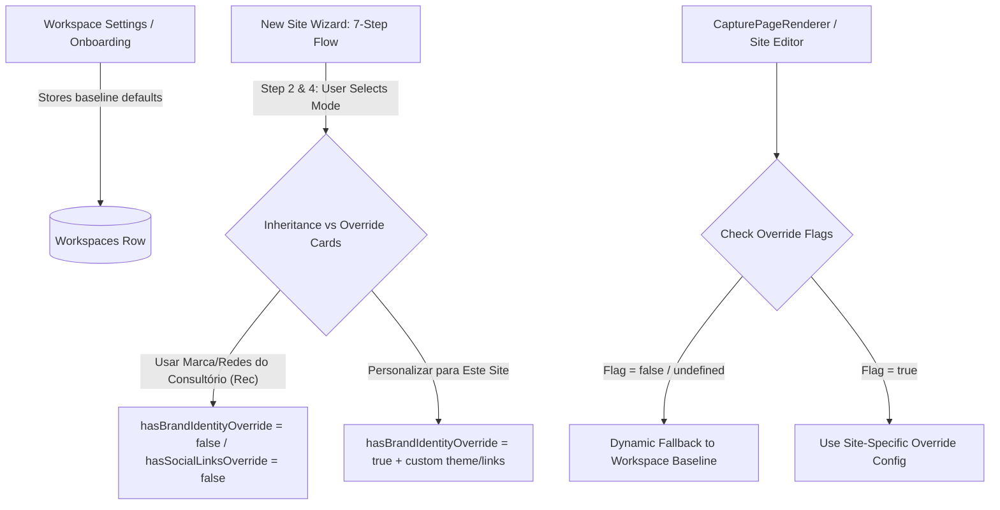

# 🧙‍♂️ Architecture Spec: Universal Workspace Inheritance & Site Creation Wizard

> **Scope**: Multi-step workspace onboarding wizard, 7-step site creation wizard, RPC workspace bootstrapping, default CRM columns, visual identity initialization, and universal inheritance & override pattern (Branding, Social Links, Professional Profile).

---

## 1. Scope & Triggers

Read this document when working on:
- Workspace onboarding wizard (`frontend/apps/web/src/app/dashboard/onboarding/page.tsx`)
- New site creation wizard (`frontend/apps/web/src/app/dashboard/captacao/nova/page.tsx`)
- Workspace settings forms (`frontend/apps/web/src/app/dashboard/configuracoes/workspace-settings-form.tsx`)
- Site renderer fallback logic (`frontend/apps/sites/src/components/CapturePageRenderer.tsx`)
- Database schema changes to workspace defaults or site config overrides

---

## 2. Inviolable Directives (ALWAYS / NEVER)

### Universal Workspace Inheritance
1. **ALWAYS Use Universal Workspace Inheritance by Default**:
   - Workspaces store baseline defaults for **Identidade Visual** (`workspaces.gradient_color_start`, `gradient_color_end`, `contrast_color`, `bg_dark_color`), **Redes Sociais & Links** (`social_links`), and **Perfil Profissional** (`name`, `crp`, `bio`).
   - The site creation wizard (`nova/page.tsx`), site editor, and site renderer MUST fetch and render the exact colors saved in the active workspace database. Sites MUST dynamically inherit workspace defaults whenever the corresponding override flag (`hasBrandIdentityOverride`, `hasSocialLinksOverride`, `hasProfileOverride`) is `false`, `null`, or `undefined`.
2. **DOMAINS ARE ALWAYS WORKSPACE-GLOBAL (NO SITE OVERRIDES)**:
   - Subdomains (`workspaces.subdomain`) and custom domains (`workspaces.custom_domain`) belong exclusively to the workspace as a whole.
   - Sites NEVER override the base domain; they only specify their URL path/slug (e.g. `/`, `/ansiedade`).
3. **ONLY Create Site Overrides when Explicitly Requested by User**:
   - Set override flags (`hasBrandIdentityOverride = true`, `hasSocialLinksOverride = true`) ONLY when the user explicitly chooses "Personalizar para Este Site" in the wizard or editor.
   - Do NOT duplicate workspace defaults into `siteConfig` when inheritance is active. This guarantees that future edits in Workspace Settings automatically cascade to all non-overridden sites.
4. **ALWAYS Follow the Initial Template Inheritance Chain for New Sites**:
   - When creating a new site in a workspace:
     - **1st Priority (Workspace Inheritance)**: Inherit `dictionary`, `siteConfig` text structure, and `formFlow` from the **most recently updated site** of the same workspace.
     - **2nd Priority (Platform Global Fallback)**: If the workspace has NO previous sites (first site of workspace), inherit the **platform global default template model** (`DEFAULT_TEMPLATE_MODEL`).

### Wizard UI/UX & Navigation
5. **ALWAYS Redirect to Creation Wizard when No Pages Exist**:
   - When accessing `/dashboard/captacao`, if the user has 0 regular pages and 0 wizard drafts, automatically redirect immediately (`router.replace('/dashboard/captacao/nova?fresh=true')`) to start the creation wizard flow.
6. **ALWAYS Display Interactive Inheritance vs Override Selection Cards in Wizard**:
   - In Step 2 (Visual Identity) and Step 4 (Social Links), render prominent selectable cards:
     - Card A (Recommended): "Usar marca do consultório" (Shows live workspace color pills & logo preview).
     - Card B: "Personalizar para este site" (Opens color picker inputs & custom logo upload).
7. **NEVER Inject Hidden Text Fallbacks in Production Rendering**:
   - `CapturePageRenderer.tsx` MUST NOT render hardcoded default strings to disguise missing DB text content in live public sites. If a text field in `dictionary` is missing or empty on a live site, render `null`/empty.
   - In editor/preview mode (`isPreview === true`), render explicit visual placeholders (`[Campo Vazio - ...]`) so the editor clearly identifies empty fields.

---

## 3. Feature Architecture & UI/UX Design System



### 7-Step Site Creation Wizard Layout (`nova/page.tsx`)

| Step # | Title & Purpose | Primary UI Component | Behavior / Action |
|---|---|---|---|
| **Etapa 1** | Nome da Profissional / Página | Input Text + Pre-fill | Set title and psychologist name |
| **Etapa 2** | Identidade Visual | Dual Choice Cards (Inherit vs Custom) | `hasBrandIdentityOverride` flag |
| **Etapa 3** | Endereço na Internet | Subdomain badge + Slug Input | Live preview: `subdomain.psi.app/slug` |
| **Etapa 4** | Redes Sociais & Links | Dual Choice Cards + Link Fields | `hasSocialLinksOverride` flag |
| **Etapa 5** | Destino do CTA Principal | Radio Cards (Form, WhatsApp, URL) | Select CTA destination type |
| **Etapa 6** | SEO & Redes Sociais | Meta Title, Description, OG Cover | SEO social share optimization |
| **Etapa 7** | Revisão & Instanciação | Summary Review Card + Submit | Trigger page instantiation |

---

## 4. Concrete Code Recipes & Schemas

### Universal Inheritance Matrix

| Property Category | Workspace Baseline Column | Site Config Override Flag | Renderer Fallback Logic |
|---|---|---|---|
| **Redes Sociais & Links** | `workspaces.social_links` | `hasSocialLinksOverride: boolean` | `cfg.hasSocialLinksOverride ? cfg.socialLinks : tenant.social_links` |
| **Identidade Visual (Branding)** | `workspaces.gradient_color_start`, `end`, `contrast_color` | `hasBrandIdentityOverride: boolean` | `cfg.hasBrandIdentityOverride ? cfg.theme : tenant.defaultSite...` |
| **Perfil Profissional & CRP** | `workspaces.name`, `crp` | `hasProfileOverride: boolean` | `cfg.hasProfileOverride ? cfg.professional : tenant.name` |
| **Domínios & Subdomínios** | `workspaces.subdomain` | ❌ **Nenhum** (Workspace Global) | Base domain is always workspace-wide; site sets `slug` |

### CTA Resolution Pattern in `CapturePageRenderer.tsx`

```typescript
const handleCtaClick = () => {
  const ctaType = page.ctaType || page.siteConfig?.ctaType || 'form';

  if (ctaType === 'whatsapp') {
    const rawPhone = tenant.phone ? tenant.phone.replace(/\D/g, '') : '';
    const message = page.ctaWhatsappMessage || page.siteConfig?.ctaWhatsappMessage || 'Olá! Gostaria de agendar uma consulta.';
    const encodedMessage = encodeURIComponent(message);
    const waUrl = rawPhone ? `https://wa.me/55${rawPhone}?text=${encodedMessage}` : `https://wa.me/?text=${encodedMessage}`;
    window.open(waUrl, '_blank');
    return;
  }

  if (ctaType === 'external_url') {
    const targetUrl = page.ctaExternalUrl || page.siteConfig?.ctaExternalUrl;
    if (targetUrl) {
      const url = targetUrl.startsWith('http://') || targetUrl.startsWith('https://') ? targetUrl : `https://${targetUrl}`;
      window.open(url, '_blank');
    } else {
      setModalOpen(true);
    }
    return;
  }

  setModalOpen(true);
};
```

---

## 5. Anti-Patterns & Prohibitions

### ❌ ERRADO: Copiar as cores da marca do consultório para o `siteConfig` ao criar um site com opção padrão
```typescript
// NUNCA faça isso: se o psicólogo alterar a cor do consultório depois nas Configurações, o site ficará desatualizado
const newSiteConfig = {
  theme: {
    primaryColor: tenant.gradient_color_start, // ❌ Quebra a herança dinâmica!
  },
  hasBrandIdentityOverride: false,
};
```

### ✅ CORRETO: Manter `hasBrandIdentityOverride: false` e deixar `theme` como undefined
```typescript
// CORRETO: O site herda dinamicamente em tempo real qualquer alteração feita no consultório
const newSiteConfig = {
  theme: undefined,
  hasBrandIdentityOverride: false,
};
```
