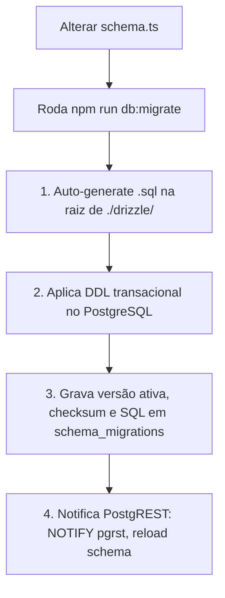

# 🔒 Core Rule 02: Database, RLS & Migration Workflow

> **Scope & Triggers**: Leia este arquivo antes de alterar o schema TypeScript `src/shared/schema.ts`, executar migrações com `npm run db:migrate`, criar tabelas, ajustar regras de RLS ou criar RPCs Stored Functions.

---

## ⚡ 1. Directives & Constraints (ALWAYS / NEVER)

- **ALWAYS use the CLI scripts `db:migrate` and `db:version`**: NUNCA crie arquivos `.sql` manualmente fora do CLI e NUNCA execute `drizzle-kit generate` avulso.
- **ALWAYS enable RLS on every public table**: Toda tabela criada em `public` deve conter `ALTER TABLE public.<table_name> ENABLE ROW LEVEL SECURITY;`.
- **ALWAYS isolate tenant data by `workspace_id`**: As tabelas devem ter a coluna `workspace_id uuid NOT NULL REFERENCES public.workspaces(id) ON DELETE CASCADE`.
- **NEVER expose Service Keys to the Frontend**: Operações administrativas exigem backend Fastify ou Stored Functions com `SECURITY DEFINER`.

---

## 🏗️ 2. Database & Migration Workflow



### Regra de Versionamento (`npm run db:version`)
- Durante a versão ativa (ex: `v1.0.1`), as migrações geradas ficam soltas na raiz de `./drizzle/`.
- Ao encerrar a versão e abrir um novo release (ex: `v1.1.0`), o comando `npm run db:version` move os `.sql` da raiz para `./drizzle/migrations/v1.0.1/` e consolida o baseline DDL `./drizzle/schema_baseline.sql`.

---

## 📖 3. Concrete Code Recipes

### Padrão de Política RLS (Multi-tenant por Workspace)
```sql
ALTER TABLE public.contacts ENABLE ROW LEVEL SECURITY;

-- Política de Leitura para Membros do Workspace
CREATE POLICY "Membros podem ler dados do proprio workspace"
ON public.contacts
FOR SELECT
TO authenticated
USING (
  workspace_id IN (
    SELECT workspace_id 
    FROM public.workspace_members 
    WHERE user_id = auth.uid()
  )
);

-- Política de Inserção e Atualização
CREATE POLICY "Membros podem modificar dados do proprio workspace"
ON public.contacts
FOR ALL
TO authenticated
USING (
  workspace_id IN (
    SELECT workspace_id 
    FROM public.workspace_members 
    WHERE user_id = auth.uid()
  )
)
WITH CHECK (
  workspace_id IN (
    SELECT workspace_id 
    FROM public.workspace_members 
    WHERE user_id = auth.uid()
  )
);
```

### Padrão de Stored Function RPC (`SECURITY DEFINER`)
```sql
CREATE OR REPLACE FUNCTION public.bootstrap_workspace(
  p_workspace_name text,
  p_user_id uuid
)
RETURNS uuid
LANGUAGE plpgsql
SECURITY DEFINER
AS $$
DECLARE
  v_workspace_id uuid;
BEGIN
  INSERT INTO public.workspaces (name, owner_id)
  VALUES (p_workspace_name, p_user_id)
  RETURNING id INTO v_workspace_id;

  INSERT INTO public.workspace_members (workspace_id, user_id, role)
  VALUES (v_workspace_id, p_user_id, 'owner');

  RETURN v_workspace_id;
END;
$$;
```
Exposto automaticamente pelo PostgREST como `POST /rest/v1/rpc/bootstrap_workspace`.

---

## ❌ 4. Anti-Patterns & Prohibitions

### ❌ ERRADO: Criar tabela no banco sem RLS
```sql
-- ❌ INSEGURO: Tabela sem RLS permite vazamento de dados entre tenants
CREATE TABLE public.contacts (
  id uuid PRIMARY KEY DEFAULT gen_random_uuid(),
  name text
);
```

### ✅ CORRETO: Criar tabela com workspace_id e RLS ativo
```sql
-- ✅ SEGURO: Tabela vinculada ao workspace_id e RLS habilitado
CREATE TABLE public.contacts (
  id uuid PRIMARY KEY DEFAULT gen_random_uuid(),
  workspace_id uuid NOT NULL REFERENCES public.workspaces(id) ON DELETE CASCADE,
  name text
);
ALTER TABLE public.contacts ENABLE ROW LEVEL SECURITY;
```
