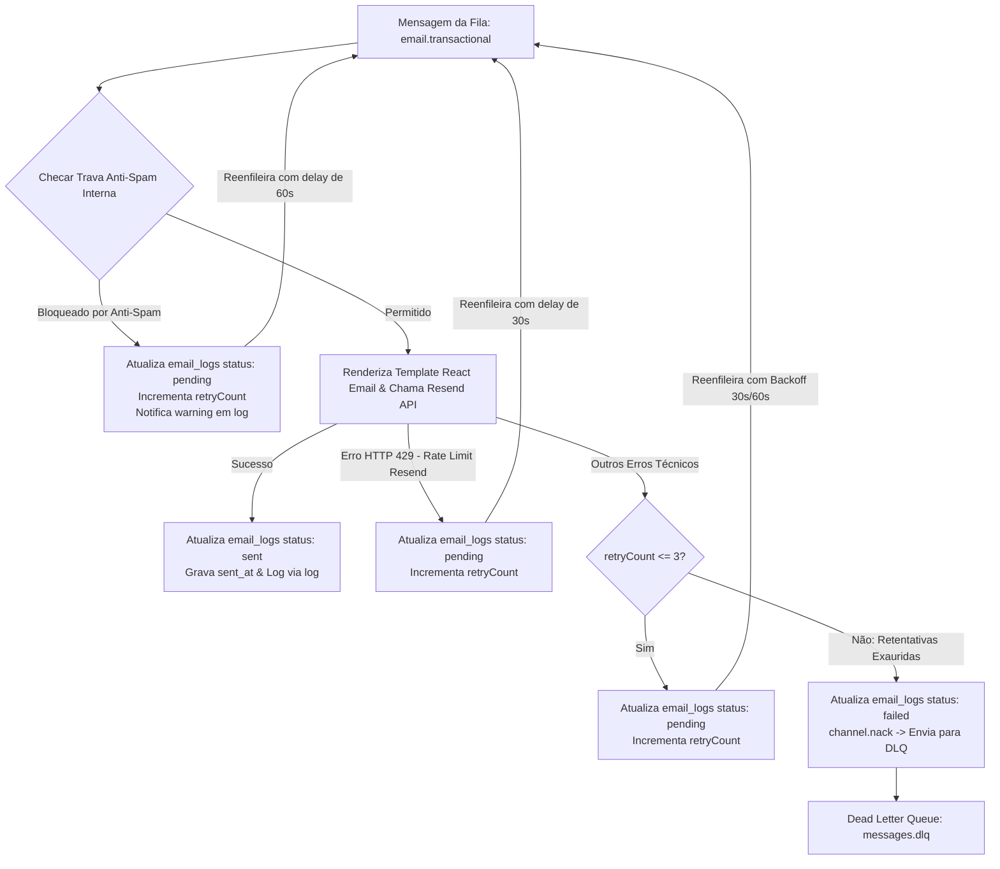

# 📧 Core Rule 05: Email & Communications Architecture

> **Scope & Triggers**: Leia este arquivo antes de disparar e-mails, criar templates de e-mail com React Email, integrar com a API do Resend ou alterar os consumidores `emailConsumer.ts`, `rate-limiter.ts` e `dlqConsumer.ts`.

---

## ⚡ 1. Directives & Constraints (ALWAYS / NEVER)

- **NEVER call Resend API directly inside HTTP handlers**: NUNCA chame a API do Resend de forma síncrona dentro de rotas da API Fastify.
- **ALWAYS queue email requests via `queueEmail()`**: Disparos de e-mail pertencem obrigatoriamente à fila `email.transactional` no RabbitMQ.
- **NEVER mark rate-limited emails as `failed`**: Bloqueios de limite de taxa (anti-spam interno ou HTTP 429 do Resend) **DEVEM PERMANECER COMO `status: 'pending'`** no banco `email_logs`.
- **ALWAYS allow unlimited retries for rate-limit / anti-spam events**: E-mails retidos por limites de taxa são reagendados assincronamente com delay (60s anti-spam / 30s HTTP 429) e **NUNCA** vão para a DLQ nem expiram por contador de tentativas.
- **ALWAYS limit retries to 3 for non-rate-limit technical errors**: Apenas falhas técnicas não-relacionadas a rate limit (domínio ausente, erros de compilação, etc.) possuem limite de 3 retentativas antes de mudar o status para `failed` e dar `channel.nack()` para a DLQ (`messages.dlq`).
- **ALWAYS use React Email templates**: Templates de e-mail devem ser construídos usando `@react-email/components` em `src/emails/templates/`.
- **ALWAYS propagate `requestId` and `sessionId` in email payloads**: O payload enfileirado deve preservar os dados de observabilidade no campo `metadata`.
- **ALWAYS maintain atomic status updates in `email_logs`**: O `queueEmail()` cria o registro inicial pendente com `emailLogId` e os workers atualizam o mesmo registro (evitando linhas duplicadas/órfãs).

---

## 🛡️ 2. Regras de Rate-Limit e Anti-Spam por Destinatário

A verificação anti-spam por destinatário é executada preventivamente **ANTES** de chamar a API do Resend para proteger a reputação do domínio e economizar cotas de API:

| Regra | Intervalo / Limite | Comportamento no Bloqueio |
| :--- | :--- | :--- |
| **Proteção de Rajada (Burst)** | Mínimo de 3 segundos entre envios do mesmo template | Mantém `status: 'pending'`, reagenda em 60s via `publishToQueue` |
| **Mesmo Template por Minuto** | Máximo 2 e-mails do mesmo template em 60s | Permite login simultâneo no `web` e `admin`. A partir do 3º, mantém `status: 'pending'`, reagenda em 60s |
| **Volume Total por 5 Minutos** | Máximo 5 e-mails de qualquer template em 300s | Mantém `status: 'pending'`, reagenda em 60s |
| **Resend HTTP 429 Rate Limit** | Retorno 429 da API externa do Resend | Mantém `status: 'pending'`, reagenda em 30s |

---

## 🏗️ 3. Diagrama do Fluxo de Decisão no Worker (`emailConsumer.ts`)



---

## 📋 4. Schema & Tabela `email_logs`

| Coluna | Tipo | Nullable | Descrição |
| :--- | :--- | :--- | :--- |
| `id` | `uuid` | `NO` | Identificador único (`emailLogId`) |
| `to_email` | `text` | `NO` | E-mail do destinatário |
| `subject` | `text` | `NO` | Assunto do e-mail |
| `template` | `text` | `NO` | Nome do template React Email (`login_notification`, `invite_member`, `reset_password`) |
| `html_body` | `text` | `NO` | HTML final renderizado |
| `status` | `text` | `NO` | Status atual (`'pending'`, `'sent'`, `'failed'`) |
| `error` | `text` | `YES` | Motivo do erro ou aviso do reagendamento (ex: `"Envio bloqueado por rajada (anti-spam)..."`) |
| `retry_count` | `integer` | `NO` | Quantidade de retentativas executadas (padrão `0`) |
| `metadata` | `jsonb` | `YES` | Metadados com `requestId`, `sessionId`, `userId`, `tenantId`, `rateLimited`, `nextRetryAt` |
| `sent_at` | `timestamptz` | `YES` | Timestamp do envio concluído com sucesso (`null` se `pending` ou `failed`) |
| `created_at` | `timestamptz` | `NO` | Timestamp de criação do registro |

---

## 📖 5. Concrete Code Recipes

### Verificação de Erro de Rate-Limit (`rate-limiter.ts`)
```typescript
export function isRateLimitErrorMessage(error?: any): boolean {
  if (!error) return false;
  if (typeof error === 'object') {
    if (error.status === 429 || error.statusCode === 429 || error.name === 'rate_limit_exceeded') return true;
    error = error.message || error.reason || JSON.stringify(error);
  }
  const str = String(error).toLowerCase();
  return (
    str.includes('429') ||
    str.includes('rate limit') ||
    str.includes('rate_limit') ||
    str.includes('anti-spam') ||
    str.includes('limite de taxa') ||
    str.includes('limite de volume') ||
    str.includes('too many requests')
  );
}
```

### Reagendamento Assíncrono Mantendo Status `pending` (`emailConsumer.ts`)
```typescript
// Se bloqueado por rate-limit (anti-spam ou Resend 429)
const nextRetry = retryCount + 1;
const delayMs = 60 * 1000;

await updateOrCreateEmailLog({
  emailLogId,
  toEmail: to,
  subject,
  template,
  status: 'pending', // PERMANECE PENDING
  error: `${errMsg} (Reagendado automaticamente em 60s - Tentativa ${nextRetry})`,
  retryCount: nextRetry,
  metadata: { ...metadata, rateLimited: true },
});

setTimeout(async () => {
  await publishToQueue(ROUTING_KEY, {
    ...parsedPayload,
    emailLogId,
    retryCount: nextRetry,
    _requeuedFromRateLimitAt: new Date().toISOString(),
  });
}, delayMs);

channel.ack(msg);
```

---

## ❌ 6. Anti-Patterns & Prohibitions

### ❌ ERRADO: Dar `channel.ack()` e marcar como `failed` em caso de Rate-Limit
```typescript
// ❌ INCORRETO: Marca o e-mail como falho permanentemente e joga a mensagem fora
if (!antiSpamCheck.allowed) {
  await updateOrCreateEmailLog({ emailLogId, status: 'failed', error: antiSpamCheck.reason });
  channel.ack(msg);
  return;
}
```

### ✅ CORRETO: Manter como `pending` e re-enfileirar assincronamente com delay
```typescript
// ✅ CORRETO: Mantém status pending, incrementa retentativas e reenfileira com delay sem perder o e-mail
if (!antiSpamCheck.allowed) {
  await updateOrCreateEmailLog({ emailLogId, status: 'pending', error: `${antiSpamCheck.reason} (Tentativa X)` });
  setTimeout(() => publishToQueue(ROUTING_KEY, payload), 60000);
  channel.ack(msg);
  return;
}
```
