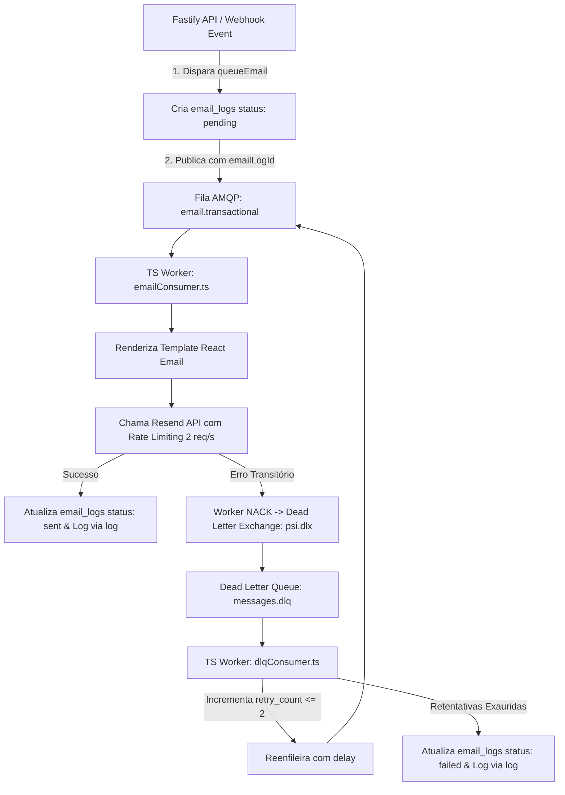

# 📧 Core Rule 05: Email & Communications Architecture

> **Scope & Triggers**: Leia este arquivo antes de disparar e-mails, criar templates de e-mail com React Email, integrar com a API do Resend ou alterar os consumidores `emailConsumer.ts` e `dlqConsumer.ts`.

---

## ⚡ 1. Directives & Constraints (ALWAYS / NEVER)

- **NEVER call Resend API directly inside HTTP handlers**: NUNCA chame a API do Resend de forma síncrona dentro de rotas da API Fastify.
- **ALWAYS queue email requests via `queueEmail()`**: Disparos de e-mail pertencem obrigatoriamente à fila `email.transactional` no RabbitMQ.
- **ALWAYS use React Email templates**: Templates de e-mail devem ser construídos usando `@react-email/components` em `src/emails/templates/`.
- **ALWAYS propagate `requestId` and `sessionId` in email payloads**: O payload enfileirado deve preservar os dados de observabilidade no campo `metadata`.
- **ALWAYS maintain atomic status updates in `email_logs`**: O `queueEmail()` cria o registro inicial pendente com `emailLogId` e os workers atualizam o mesmo registro (evitando linhas duplicadas/órfãs).

---

## 🏗️ 2. Email Sending Flow



---

## 📋 3. Schema & Tabela `email_logs`

| Coluna | Tipo | Nullable | Descrição |
| :--- | :--- | :--- | :--- |
| `id` | `uuid` | `NO` | Identificador único (`emailLogId`) |
| `to_email` | `text` | `NO` | E-mail do destinatário |
| `subject` | `text` | `NO` | Assunto do e-mail |
| `template` | `text` | `NO` | Nome do template React Email (`login_notification`, `invite_member`, `reset_password`) |
| `html_body` | `text` | `NO` | HTML final renderizado |
| `status` | `text` | `NO` | Status atual (`'pending'`, `'sent'`, `'failed'`) |
| `error` | `text` | `YES` | Motivo do erro em caso de falha |
| `retry_count` | `integer` | `NO` | Quantidade de retentativas executadas (padrão `0`) |
| `metadata` | `jsonb` | `YES` | Metadados com `requestId`, `sessionId`, `userId`, `tenantId` |
| `sent_at` | `timestamptz` | `YES` | Timestamp do momento do envio efetuado com sucesso |
| `created_at` | `timestamptz` | `NO` | Timestamp da criação do registro |

---

## 📖 4. Concrete Code Recipes

### Enfileirando E-mail na API Fastify (Não-bloqueante)
```typescript
import { queueEmail } from '../../../emails/queue-email';

// Dentro de uma rota Fastify:
await queueEmail({
  template: 'invite_member',
  to: 'colaborador@exemplo.com',
  subject: 'Você foi convidado para colaborar',
  props: {
    inviterName: 'Dr. Carlos',
    workspaceName: 'Clínica Espaço Vida',
    inviteLink: 'https://app.psi.com.br/invite/xyz'
  },
  metadata: {
    requestId: (request.raw as any).requestId,
    userId: (request.raw as any).userId,
    sessionId: (request.raw as any).sessionId,
    workspaceId
  }
});
```

---

## ❌ 5. Anti-Patterns & Prohibitions

### ❌ ERRADO: Inserir novo registro em `email_logs` a cada retentativa
```typescript
// ❌ INCORRETO: Cria múltiplas linhas duplicadas/órfãs no banco para o mesmo e-mail
await db.insert(emailLogs).values({ toEmail: to, status: 'failed', error: err.message });
```

### ✅ CORRETO: Atualizar o registro existente vinculado ao `emailLogId`
```typescript
// ✅ CORRETO: Atualiza atomicamente o registro existente incrementando retryCount
if (emailLogId) {
  await db.update(emailLogs)
    .set({ status: 'failed', error: err.message, retryCount: nextRetryCount })
    .where(eq(emailLogs.id, emailLogId));
}
```
