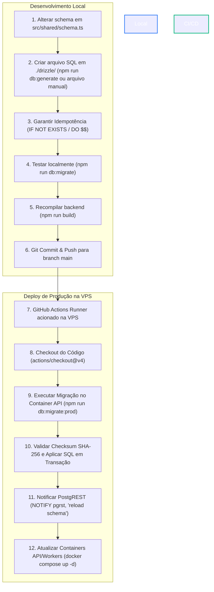

# 🗄️ Core Rule 08: Database Migrations & Versioning Workflow Guide

> **Scope & Triggers**: Leia este arquivo antes de alterar o schema TypeScript (`backend/src/shared/schema.ts`), criar novos arquivos de migração `.sql` na pasta `./drizzle/`, rodar migrações em desenvolvimento ou publicar alterações no banco de dados para o ambiente de produção.

---

## ⚡ 1. Directives & Constraints (ALWAYS / NEVER)

1. **NEVER edit or mutate executed migration files**:
   - Arquivos `.sql` aplicados no banco possuem integridade protegida por hash SHA-256 gravado na tabela `public.schema_migrations`.
   - Qualquer nova alteração de tabela, coluna, RPC ou trigger DEVE ser escrita em um **NOVO arquivo `.sql`** (ex: `0025_...sql`).
2. **ALWAYS make migration scripts 100% idempotent**:
   - Utilize `CREATE TABLE IF NOT EXISTS` para tabelas.
   - Utilize `ALTER TABLE IF EXISTS ... ADD COLUMN IF NOT EXISTS` para colunas.
   - Utilize `DROP POLICY IF EXISTS` antes de `CREATE POLICY`.
   - Envolva restrições de Foreign Key ou Unique em blocos `DO $$ BEGIN IF NOT EXISTS (SELECT 1 FROM pg_constraint...) THEN ... END IF; END $$;`.
3. **ALWAYS keep active migrations in the root of `./drizzle/`**:
   - Novas migrações da versão ativa pertencem exclusivamente à raiz da pasta `./drizzle/` (ex: `backend/drizzle/0025_nome.sql`).
   - A pasta `./drizzle/migrations/vX.X.X/` é reservada estritamente para o arquivamento de versões encerradas via `npm run db:version`.
4. **ALWAYS recompile the backend after creating migrations**:
   - Após criar ou testar uma migração, execute `npm run build` na pasta `backend/` para atualizar os artefatos compilados em `dist/scripts/migrate.js`.

---

## 🗺️ 2. Migration Architecture & Flowchart



---

## 📖 3. Guia Passo a Passo: Do Desenvolvimento à Produção

### Passo 1: Como Criar uma Nova Migração (Dev)

#### Opção A: Alteração de Schema TypeScript (Drizzle Kit)
Se você alterou o arquivo `backend/src/shared/schema.ts`:
```bash
cd backend
npm run db:generate
```
* O Drizzle Kit compara o `schema.ts` com a estrutura e gera o arquivo `.sql` numerado na raiz de `backend/drizzle/` (ex: `0025_funny_name.sql`).

#### Opção B: Migração Manual (Stored Functions, RPCs, Triggers, RLS)
Se você criou uma nova Stored Function, Procedure ou Trigger:
1. Crie um novo arquivo `.sql` na raiz de `backend/drizzle/` seguindo a sequência numérica (ex: `backend/drizzle/0025_add_custom_rpc.sql`).
2. Escreva o comando SQL utilizando sintaxe **idempotente**:
```sql
-- Exemplo de Migração Idempotente
CREATE OR REPLACE FUNCTION public.calcular_total_lead(p_contact_id UUID)
RETURNS NUMERIC
LANGUAGE plpgsql
SECURITY DEFINER
AS $$
BEGIN
  RETURN 0;
END;
$$;

GRANT EXECUTE ON FUNCTION public.calcular_total_lead(UUID) TO authenticated, service_role;
```

---

### Passo 2: Como Testar a Migração Localmente

Antes de fazer commit, valide a migração no seu banco de dados local:

```bash
cd backend

# 1. Executar as migrações locais
npm run db:migrate

# 2. Recompilar os arquivos JS para a pasta dist/
npm run build
```

---

### Passo 3: Como Enviar para Produção

Após validar localmente e recompilar o código:

```bash
git add .
git commit -m "feat(db): adiciona nova tabela/rpc para funcionalidade x"
git push origin main
```

**O que acontece na VPS automaticamente via GitHub Actions**:
1. O runner `self-hosted` inicia o job de deploy.
2. Inicia o banco de dados PostgreSQL e o RabbitMQ.
3. Executa as migrações pendentes de forma transacional:
   `docker compose -f backend/docker-compose.prod.yml run --rm api npm run db:migrate:prod`
4. Se a migração passar com sucesso, a stack de contêineres (`api`, `workers`, `nginx`) é atualizada sem downtime.
5. O PostgREST é notificado instantaneamente para recarregar o cache de schema.

---

### Passo 4: Fechamento de Release & Versão (`npm run db:version`)

Quando uma nova versão estável do sistema for lançada (ex: transição de `v1.0.0` para `v1.1.0`):

```bash
cd backend
npm run db:version
```

O CLI interativo irá:
1. Executar e garantir que todas as migrações pendentes estão registradas.
2. Mover todos os arquivos `.sql` antigos da raiz de `./drizzle/` para a pasta de histórico `./drizzle/migrations/v1.0.0/`.
3. Gerar um novo arquivo `schema_baseline.sql` purificado e consolidado via `pg_dump`.
4. Registrar a nova versão ativa na tabela `public.schema_versions`.

---

## ❌ 4. Anti-Patterns & Proibições

### ❌ ERRADO: Editar um arquivo `.sql` antigo que já foi executado
```sql
-- ❌ NÃO FAÇA ISSO: Editar 0015_enable_rls.sql após já ter sido aplicado no banco
-- Isso vai quebrar a verificação de SHA-256 e interromper o deploy em produção!
```

### ✅ CORRETO: Criar um novo arquivo numerado para alterar o schema
```sql
-- ✅ FAÇA ISSO: Criar 0026_update_rls_policies.sql na raiz de ./drizzle/
DROP POLICY IF EXISTS "antiga_policy" ON public.minha_tabela;
CREATE POLICY "nova_policy" ON public.minha_tabela ...;
```

---

### ❌ ERRADO: Criar comandos DDL sem cláusula de idempotência
```sql
-- ❌ NÃO FAÇA ISSO: Falhará se a coluna já existir no banco
ALTER TABLE public.workspaces ADD COLUMN status text;
```

### ✅ CORRETO: Utilizar `IF NOT EXISTS` / `IF EXISTS`
```sql
-- ✅ FAÇA ISSO: Executa com segurança independente do estado prévio do banco
ALTER TABLE IF EXISTS public.workspaces ADD COLUMN IF NOT EXISTS status text;
```
