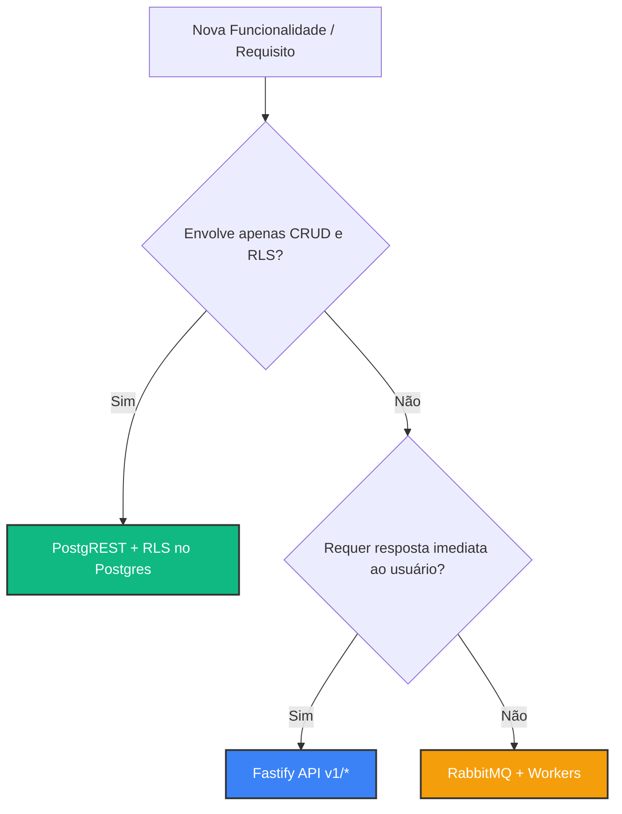

# 📘 Guia de Tomada de Decisão Tecnológica e Regras de Desenvolvimento

Este guia serve como diretriz para desenvolvedores e agentes de IA que trabalham no projeto. Ele define com clareza **quando**, **onde** e **como** utilizar cada ferramenta da stack para evitar a criação de rotas redundantes, evitar alucinações de desenvolvimento e extrair o máximo de proveito da arquitetura.

---

## 🗺️ Matriz de Decisão: Onde implementar meu código?

Use o fluxograma abaixo para decidir qual ferramenta utilizar para cada tipo de tarefa:

---

## 🛠️ Detalhamento por Componente da Stack

### 1. 📝 PostgREST (Acesso Direto ao Banco pelo Frontend)

* **Onde fica:** Exposto externamente em `/rest/v1/*`.
* **Quando usar:**
  * **Sempre** para leituras (SELECT) e escritas simples (INSERT, UPDATE, DELETE) feitas pelo frontend.
  * Listagens de tabelas (ex: logs de e-mails, listas de tenants, perfis de usuários).
  * Filtros de busca, ordenação e paginação (PostgREST resolve isso nativamente via parâmetros de URL).
* **Quando NÃO usar:**
  * Lógicas que envolvam chamadas a APIs de terceiros (ex: gateway de pagamento).
  * Ações manuais complexas que necessitem de transações customizadas em múltiplos servidores.
* **Regra de Ouro:** **Nunca crie rotas de "espelho" no Fastify** que façam apenas um `db.select().from(...)` e retornem o JSON. Use o PostgREST diretamente e trate a segurança por meio de Row-Level Security (RLS) no PostgreSQL.

---

### 2. 🐘 PostgreSQL (Segurança, RLS e Persistência)

* **Onde fica:** Schema `public` para dados de negócios, e schema `auth` para dados de login (GoTrue).
* **Políticas RLS (Row-Level Security):**
  * Toda tabela exposta via PostgREST **deve** possuir RLS ativo (`ALTER TABLE ... ENABLE ROW LEVEL SECURITY`).
  * As políticas de leitura/escrita devem usar a função `auth.uid()` para isolar dados de usuários ou perfis de forma estrita.
  * **Atenção (PostgREST v12+):** A função `auth.uid()` deve ler a claim `sub` do JSON do JWT em `current_setting('request.jwt.claims', true)` e não apenas o parâmetro plano `request.jwt.claim.sub`.
* **Escrevendo Migrações:**
  * Gerar migrações utilizando o Drizzle-Kit: `npm run db:generate`.
  * Aplicar migrações: `npm run db:migrate` ou usando comandos automatizados nas ferramentas da infraestrutura.

---

### 3. ⚡ Fastify API (Regras de Negócio, Ações e WebSocket)

* **Onde fica:** Rotas sob `src/apis/core/routes/` ou outras sub-APIs, expostas em `/v1/*`.
* **Quando usar:**
  * Endpoints de ações ou operações de controle (ex: `POST /platform/emails/:id/resend` para disparar um reenvio, `POST /platform/setup/cloudflare` para validar configurações).
  * Integrações com serviços terceiros (consultar a API do Resend, fazer uploads para Cloudflare R2).
  * Rotas que precisam emitir atualizações em tempo real (ex: Websockets utilizando o Socket.io).
* **Garantias de Escala:**
  * O Socket.io deve ser configurado obrigatoriamente para usar apenas o transporte `websocket` (sem polling HTTP), garantindo que réplicas possam rodar sem a necessidade de *sticky sessions* ou roteadores persistentes.

---

### 4. 🐇 RabbitMQ & Workers (Processamento Assíncrono e Resiliência)

* **Onde fica:** Mensagens publicadas com `publishToQueue()` e consumidas em `src/workers/index.ts`.
* **Quando usar:**
  * Processamento pesado ou demorado (envio de e-mails, webhooks, relatórios, processamento de mídia).
  * Garantia de entrega: filas configuradas como Quorum Queues (`arguments: { 'x-queue-type': 'quorum' }`).
* **Tratamento de Erros e DLQ (Dead Letter Queue):**
  * **Falhas de Sistema / Configuração**: Se o processamento falhar devido a erros que exijam ação manual (ex: API key do Resend inválida ou domínio não verificado), grave o log da falha como `'failed'` no banco de dados e envie a mensagem para a DLQ executando `channel.nack(msg, false, false)`.
  * **Spam Prevention (Rate Limiting)**: O limite de taxa deve ser validado preventivamente no worker consultando a tabela `email_logs`. Se o e-mail for bloqueado pelo limite de spam, registre a falha de limite no banco de dados e execute `channel.ack(msg)` (descarte seguro) para evitar loops na fila ou ida inadequada para a DLQ.

---

### 5. 🟢 Nginx Proxy (Gateway de Borda)

* **Onde fica:** Arquivo `.docker/nginx/nginx.conf`.
* **Quando alterar:**
  * Apenas ao adicionar uma sub-API modular em `src/apis/` ou ao alterar as regras gerais de roteamento de borda.
  * Mantém o isolamento dos servidores internos da rede docker exposta para a internet.

---

### 6. 👥 Tenants, RBAC e Assinaturas

* **Onde fica:** Tabelas `tenants` (dono em `owner_id`), `tenant_members` e a view `tenant_subscriptions` no banco de dados.
* **Isolamento de Dados e RBAC**:
  * Qualquer tabela ou recurso que pertença a um tenant **deve** conter uma coluna `tenant_id uuid` e ter RLS habilitada.
  * Use as funções auxiliares `public.is_tenant_member(tenant_id)` para autorizar leituras (SELECT) e `public.is_tenant_admin(tenant_id)` para autorizar escritas (INSERT, UPDATE, DELETE) nas RLS.
  * Estas funções são `SECURITY DEFINER` e resolvem se o usuário atual é dono (`owner_id`), admin da equipe (role `'admin'` em `tenant_members`), ou administrador global (`is_admin()`).
* **Cálculo de Preço Dinâmico**:
  * O cálculo de assinaturas ($X + N \times Y$) é feito dinamicamente no Postgres pela View `public.tenant_subscriptions`.
  * **Sempre consuma esta View** via PostgREST `/rest/v1/tenant_subscriptions` para garantir que o painel administrativo global e a página de faturamento do usuário exibam os mesmos valores consolidados.

---

## 🚫 Práticas Proibidas (Anti-patterns)

1. ❌ **Ignorar RLS e criar rotas Fastify para ler registros**: Isso infla o código do servidor HTTP desnecessariamente e ignora os benefícios nativos do PostgREST.
2. ❌ **Prender conexões de banco de dados nos Workers**: Sempre use limites estritos de conexões de pool (`POSTGRES_POOL_SIZE`) para que réplicas de workers e APIs não gerem exaustão de conexões no PostgreSQL.
3. ❌ **Nack sem "requeue=false" em loops de erro**: Nunca dê `nack` reenfileirando a mensagem infinitamente (`nack(msg, false, true)`) caso o erro seja permanente (ex: falha de autenticação do provedor de e-mail). Isso gerará gargalos e sobrecarga crítica de CPU e logs na fila.
4. ❌ **Deixar de verificar o formato do remetente**: Em integrações com o Resend, garanta que o remetente sempre seja enviado como um endereço de e-mail completo (`no-reply@domain.com`) e não apenas o domínio (`domain.com`).
