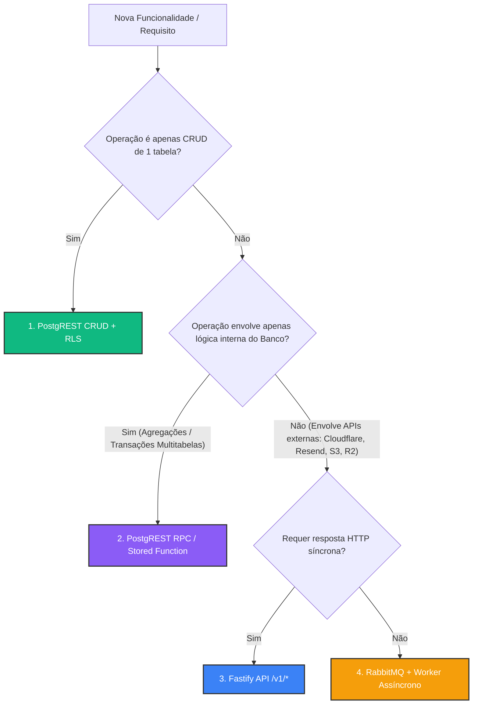

# 📘 Guia de Tomada de Decisão Tecnológica e Regras de Desenvolvimento

Este guia serve como diretriz para desenvolvedores e agentes de IA que trabalham no projeto. Ele define com clareza **quando**, **onde** e **como** utilizar cada ferramenta da stack para evitar a criação de rotas redundantes, evitar alucinações de desenvolvimento e extrair o máximo de proveito da arquitetura.

---

## 🗺️ Matriz de Decisão: Onde implementar meu código?

Use o fluxograma abaixo para decidir qual ferramenta utilizar para cada tipo de tarefa:

---

## 🛠️ Detalhamento por Componente da Stack

### 1. 📝 PostgREST CRUD (`/rest/v1/*`)

* **Onde fica:** Exposto em `/rest/v1/<nome_da_tabela>`.
* **Quando usar:**
  * **Sempre** para leituras (SELECT) e escritas simples (INSERT, UPDATE, DELETE) feitas pelo frontend.
  * Listagens de tabelas (ex: logs de e-mails, listas de workspaces, perfis de usuários).
  * Filtros de busca, ordenação e paginação (PostgREST resolve isso nativamente via parâmetros de URL).
* **Quando NÃO usar:**
  * Lógicas que envolvam chamadas a APIs de terceiros (ex: Cloudflare, R2, Resend).
  * Agregações complexas ou transações em lote multitabelas (utilize **RPC**).
* **Regra de Ouro:** **Nunca crie rotas de "espelho" no Fastify** que façam apenas um `db.select().from(...)` e retornem o JSON. Use o PostgREST diretamente com Row-Level Security (RLS).

---

### 2. ⚡ PostgREST RPC / Stored Functions (`/rest/v1/rpc/*`)

* **Onde fica:** Exposto automaticamente em `POST /rest/v1/rpc/<nome_da_funcao>`.
* **Quando usar RPC (Stored Procedures no Postgres):**
  * **Agregações e Relatórios Pesados**: Quando for necessário calcular estatísticas ou métricas complexas no banco, evitando trafegar registros desnecessários pela rede.
  * **Transações Atômicas Multitabelas**: Quando uma operação precisar alterar/inserir dados em 2 ou mais tabelas de forma garantidamente atômica (ex: criar workspace + criar colunas padrão do CRM + criar identidade visual em 1 transação).
  * **Bypass Seguro de RLS (`SECURITY DEFINER`)**: Quando a operação exigir elevação controlada de privilégios sem expor service keys no frontend.
* **Vantagens em relação a uma Rota na API Fastify:**
  * **Zero código de servidor Node/TS**: Não precisa criar schemas Drizzle, tipos Zod nem rotas no Fastify.
  * **Performance Máxima**: A lógica executa direto na memória do PostgreSQL.
  * **Suporte Nativo HTTP**: Os parâmetros do JSON enviado no POST são automaticamente mapeados para os argumentos da função PL/pgSQL.

---

### 3. 🚀 Fastify Core API & Autenticação em Cookies `HttpOnly`

* **Onde fica:** Exposto em `/v1/*`.
* **Segurança JWT & Cookies:**
  * O servidor Fastify utiliza o plugin `@fastify/cookie` e lê o token no cookie `access_token` ou no cabeçalho `Authorization: Bearer <token>`.
  * Requisições do frontend devem obrigatoriamente utilizar `credentials: 'include'`.
* **Quando usar Fastify ao invés de PostgREST ou RPC:**
  * Integrações com serviços de terceiros (Cloudflare R2, DNS, Resend, Gateways de Pagamento).
  * Uploads e processamento de arquivos/buffers.
  * Autenticação e gestão de cookies `HttpOnly` no login/logout (`/v1/auth/*`).
  * Webhooks externos que recebam payloads de parceiros (`/v1/crm/webhook`).

---

### 4. 🎨 Identidade Visual & Resolução de Marca (`visual_identities`)

* **Estrutura Relacional:**
  - Cada workspace possui sua identidade visual armazenada na tabela dedicada `visual_identities` (`primary_color`, `secondary_color`, `contrast_color`, `bg_color`, `card_color`, `text_color`, `font_heading`, `font_body`).
* **Regra de Resolução:**
  - O Front-End deve resolver marcas exclusivamente através do utilitário `getWorkspaceVisualIdentity(workspace)`.
  - Proibido declarar correntes de fallback inline com 8 níveis de `||`.

---

### 5. 🧩 Princípios SOLID e Monorepo

* **Front-End Padrão Monorepo**:
  - Componentes atômicos e apresentacionais residem no pacote compartilhado `@psi/ui`.
  - Utilitários de compressão e manipulação de imagem residem no pacote `@psi/image-utils`.
* **Diretriz de Arquivos no Front-End**:
  - Arquivos de páginas (`page.tsx`) devem se manter concisos (< 50 linhas), delegando a lógica para hooks especialistas (`usePageEditor`) e componentes dedicados (`PageEditorHeader`, `PageEditorSidebar`, `PageEditorCanvas`).
