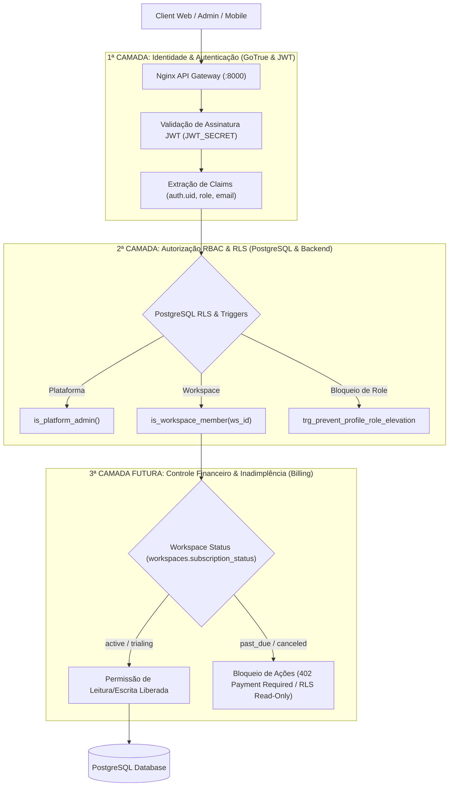
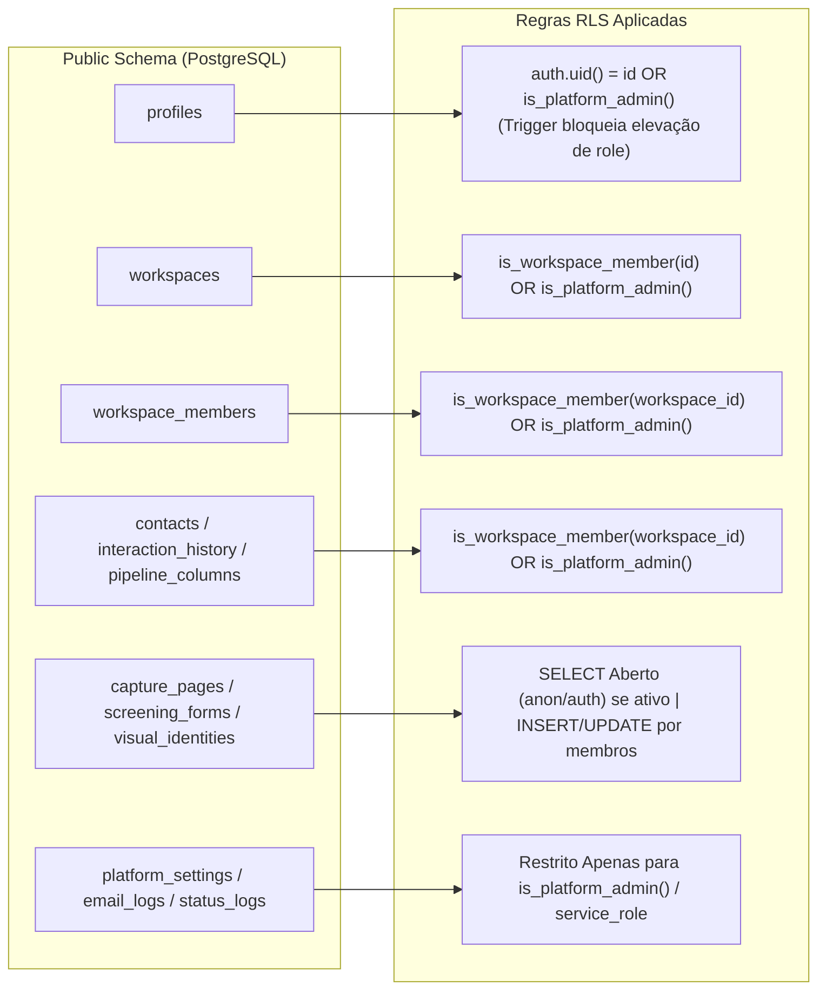

# Arquitetura de Segurança em Camadas e Políticas RLS (Row Level Security)

Este documento especifica o desenho arquitetural da segurança em camadas do sistema, detalhando o fluxo de execução das requisições, a aplicação de **Row Level Security (RLS)** no PostgreSQL, o controle de papéis de dois níveis (Plataforma + Workspace) e a futura integração da camada de Billing e controle de inadimplência.

---

## 📐 1. Fluxo Geral da Arquitetura de Segurança em Camadas

O sistema aplica o princípio de **Defesa em Profundidade (Defense-in-Depth)**. Cada requisição passa sequencialmente por 3 camadas independentes de validação:



---

## 🛡️ 2. Desenho das Políticas de RLS por Tabela no PostgreSQL

### 2.1 Funções `SECURITY DEFINER` de Apoio
Para garantir alta performance sem loops de recursão nas políticas de RLS:

* **`public.is_platform_admin()`**:
  Checa se o usuário atual (`auth.uid()`) é Super Admin na tabela `profiles`.
* **`public.is_workspace_member(ws_id)`**:
  Checa se o usuário atual faz parte da tabela `workspace_members` para determinado workspace.
* **`public.is_workspace_admin(ws_id)`**:
  Checa se o usuário atual é o `owner_id` do workspace ou se é membro com `role = 'admin'` em `workspace_members`.

---

### 2.2 Matriz de RLS e Controle de Acesso por Tabela



---

## 🔐 3. Especificação das Políticas por Tabela

| Tabela | RLS Status | Política `SELECT` | Política `INSERT / UPDATE / DELETE` |
|---|---|---|---|
| **`profiles`** | ✅ Habilitado | Próprio usuário (`id = auth.uid()`), Super Admins ou membros do mesmo workspace. | **Update**: Próprio usuário ou Admin. **Trigger** impede alteração da coluna `role` por usuários comuns. |
| **`workspaces`** | ✅ Habilitado | Membros do workspace (`is_workspace_member(id)`) ou Super Admins. | Owner (`owner_id = auth.uid()`), Admins do workspace ou Super Admins. |
| **`workspace_members`** | ✅ Habilitado | Membros do mesmo workspace ou Super Admins. | Admins do workspace (`is_workspace_admin(ws_id)`) ou Super Admins. |
| **`workspace_domains`** | ✅ Habilitado | **Público (`anon`/`authenticated`)** para resolução de sites e DNS. | Admins do workspace ou Super Admins. |
| **`visual_identities`** | ✅ Habilitado | **Público (`anon`/`authenticated`)** para branding dos sites. | Membros do workspace ou Super Admins. |
| **`capture_pages`** | ✅ Habilitado | **Público (`anon`/`authenticated`)** se `is_active = true`. | Membros do workspace ou Super Admins. |
| **`screening_forms`** | ✅ Habilitado | **Público (`anon`/`authenticated`)** se `is_active = true`. | Membros do workspace ou Super Admins. |
| **`contacts`** | ✅ Habilitado | Membros do workspace. **Insert público (`anon`)** para geração de leads. | Membros do workspace. |
| **`interaction_history`** | ✅ Habilitado | Membros do workspace. | Membros do workspace. |
| **`pipeline_columns`** | ✅ Habilitado | Membros do workspace. | Membros do workspace. |
| **`media_assets`** | ✅ Habilitado | Membros do workspace. | Membros do workspace. |
| **`platform_settings`** | ✅ Habilitado | **Apenas Super Admin (`is_platform_admin()`)**. | Apenas Super Admin ou `service_role`. |
| **`email_logs`** | ✅ Habilitado | **Apenas Super Admin (`is_platform_admin()`)**. | Apenas Super Admin ou `service_role`. |
| **`system_status_logs`** | ✅ Habilitado | **Apenas Super Admin (`is_platform_admin()`)**. | Apenas Super Admin ou `service_role`. |

---

## 💳 4. Integração Futura: Camada Financeira (Billing & Inadimplência)

Quando a lógica de pagamentos (Stripe, Asaas, etc.) for integrada:

1. **Novo Campo na Tabela `workspaces`**:
   ```sql
   ALTER TABLE workspaces ADD COLUMN subscription_status text DEFAULT 'trialing' NOT NULL;
   -- Valores possíveis: 'trialing', 'active', 'past_due', 'canceled'
   ```

2. **Extensão RLS para Controle Financeiro**:
   As políticas de escrita (`INSERT`/`UPDATE`) em dados de CRM/Pacientes podem consultar o status do workspace:
   ```sql
   CREATE OR REPLACE FUNCTION public.is_workspace_active(ws_id uuid)
   RETURNS boolean AS $$
   BEGIN
     RETURN EXISTS (
       SELECT 1 FROM public.workspaces
       WHERE id = ws_id
         AND subscription_status IN ('active', 'trialing')
     );
   END;
   $$ LANGUAGE plpgsql SECURITY DEFINER STABLE;
   ```

3. **Integração no Backend (Fastify API Middleware)**:
   * A API validará a 1ª camada (RBAC) e, em seguida, consultará o status da assinatura antes de processar ações que gerem custo ou escrita de novos registros.
