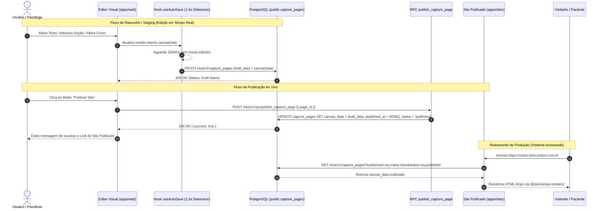

# 🚀 Staging, Publicação & Roteamento de Domínios

> **Scope**: Arquitetura do fluxo de rascunho (Staging), salvamento automático com debounce, procedimento atômico de publicação ao vivo (RPC), roteamento por subdomínios Cloudflare e domínios personalizados.

---

## 1. Scope & Triggers

Leia este arquivo quando trabalhar em:
- Persistência e salvamento automático (`useAutoSave.ts`, `usePageEditor.ts`)
- Procedimentos de publicação de páginas (`publish_capture_page` RPC)
- Roteamento de domínios e subdomínios na aplicação de produção (`apps/sites`)
- Integrações de DNS / Cloudflare e certificados SSL

---

## 2. Inviolable Directives (ALWAYS / NEVER)

1. **ALWAYS isolate Draft state (`draft_data`) from Live Published state (`canvas_data`)**:
   - As alterações feitas pelo usuário no editor de páginas devem ser salvas estritamente na coluna `draft_data` da tabela `public.capture_pages`.
   - A coluna `canvas_data` representa o site ao vivo acessado por pacientes/visitantes e **NUNCA** deve ser alterada durante operações de rascunho ou salvamento automático.
2. **ALWAYS debounce auto-save operations by 1,500ms**:
   - O hook `useAutoSave.ts` deve aguardar 1,500ms de inatividade do usuário antes de disparar a requisição `PATCH /rest/v1/capture_pages` com o novo `draft_data`, evitando sobrecarga no banco de dados e no PostgREST.
3. **ALWAYS execute publishing atomically via the `publish_capture_page` RPC**:
   - A publicação de um site ao vivo é realizada chamando a Stored Function PL/pgSQL `POST /rest/v1/rpc/publish_capture_page`.
   - Essa RPC copia atomicamente o conteúdo de `draft_data` para `canvas_data`, atualiza o carimbo de data/hora `published_at = NOW()` e altera o status para `'published'`.
4. **ALWAYS validate Row Level Security (RLS) on `capture_pages`**:
   - Edições e salvamentos no editor exigem JWT autenticado vinculado ao `workspace_id` do usuário.
   - Leituras no app de produção (`apps/sites`) são públicas via RLS anon policy filtradas por `status = 'published'` ou chave de subdomínio/domínio ativo.

---

## 3. Fluxo Visual de Salvamento & Publicação



---

## 4. Esquema de Tabelas & Procedimento RPC

### Tabela `public.capture_pages`

```sql
CREATE TABLE IF NOT EXISTS public.capture_pages (
    id UUID PRIMARY KEY DEFAULT gen_random_uuid(),
    workspace_id UUID NOT NULL REFERENCES public.workspaces(id) ON DELETE CASCADE,
    title VARCHAR(255) NOT NULL,
    slug VARCHAR(255) NOT NULL,
    subdomain VARCHAR(100) UNIQUE,
    status VARCHAR(50) NOT NULL DEFAULT 'draft', -- 'draft', 'published', 'archived'
    draft_data JSONB NOT NULL DEFAULT '{"version": "2.0", "sections": []}'::jsonb,
    canvas_data JSONB NOT NULL DEFAULT '{"version": "2.0", "sections": []}'::jsonb,
    created_at TIMESTAMPTZ NOT NULL DEFAULT NOW(),
    updated_at TIMESTAMPTZ NOT NULL DEFAULT NOW(),
    published_at TIMESTAMPTZ
);

-- Ativar RLS
ALTER TABLE public.capture_pages ENABLE ROW LEVEL SECURITY;
```

### Stored Function `publish_capture_page`

```sql
CREATE OR REPLACE FUNCTION public.publish_capture_page(p_page_id UUID)
RETURNS JSONB
LANGUAGE plpgsql
SECURITY DEFINER
AS $$
DECLARE
    v_workspace_id UUID;
    v_draft JSONB;
BEGIN
    -- 1. Verificar permissões e capturar rascunho ativo
    SELECT workspace_id, draft_data INTO v_workspace_id, v_draft
    FROM public.capture_pages
    WHERE id = p_page_id;

    IF v_draft IS NULL THEN
        RAISE EXCEPTION 'Página não encontrada ou sem rascunho para publicar.';
    END IF;

    -- 2. Copiar atomicamente draft_data -> canvas_data
    UPDATE public.capture_pages
    SET 
        canvas_data = v_draft,
        status = 'published',
        published_at = NOW(),
        updated_at = NOW()
    WHERE id = p_page_id;

    RETURN jsonb_build_object(
        'success', true,
        'page_id', p_page_id,
        'published_at', NOW()
    );
END;
$$;
```

---

## 5. Roteamento de Domínios e Subdomínios

A aplicação de produção `apps/sites` intercepta todas as requisições HTTP na camada Nginx / Next.js middleware e resolve a página publicada através de duas estratégias:

1. **Subdomínio da Plataforma (`*.psiduo.com.br`)**:
   - O Nginx encaminha o wildcard `*.psiduo.com.br` para o container `apps/sites`.
   - O Next.js extrai o subdomínio da URL (ex: `maria-silva`) e realiza a busca:
     `GET /rest/v1/capture_pages?subdomain=eq.maria-silva&status=eq.published&select=canvas_data,site_config`
2. **Domínio Customizado do Profissional (`www.psicologamaria.com.br`)**:
   - O registro DNS CNAME do cliente aponta para `cname.psiduo.com.br`.
   - O middleware busca o domínio na tabela `public.custom_domains` para resolver o `workspace_id` e a página publicada correspondente.

---

## 6. Anti-Patterns & Proibições

### ❌ Errado (Gravar Auto-Save no Canvas Publicado)
```typescript
// NUNCA atualize canvas_data diretamente no salvamento automático!
await supabase.from('capture_pages').update({
  canvas_data: newCanvasData // QUEBRA o site ao vivo dos pacientes com alterações incompletas!
}).eq('id', pageId);
```

### ✅ Correto (Isolamento Estrito no Draft)
```typescript
// Salvamento automático grava APENAS em draft_data
await supabase.from('capture_pages').update({
  draft_data: newCanvasData,
  updated_at: new Date().toISOString()
}).eq('id', pageId);
```
