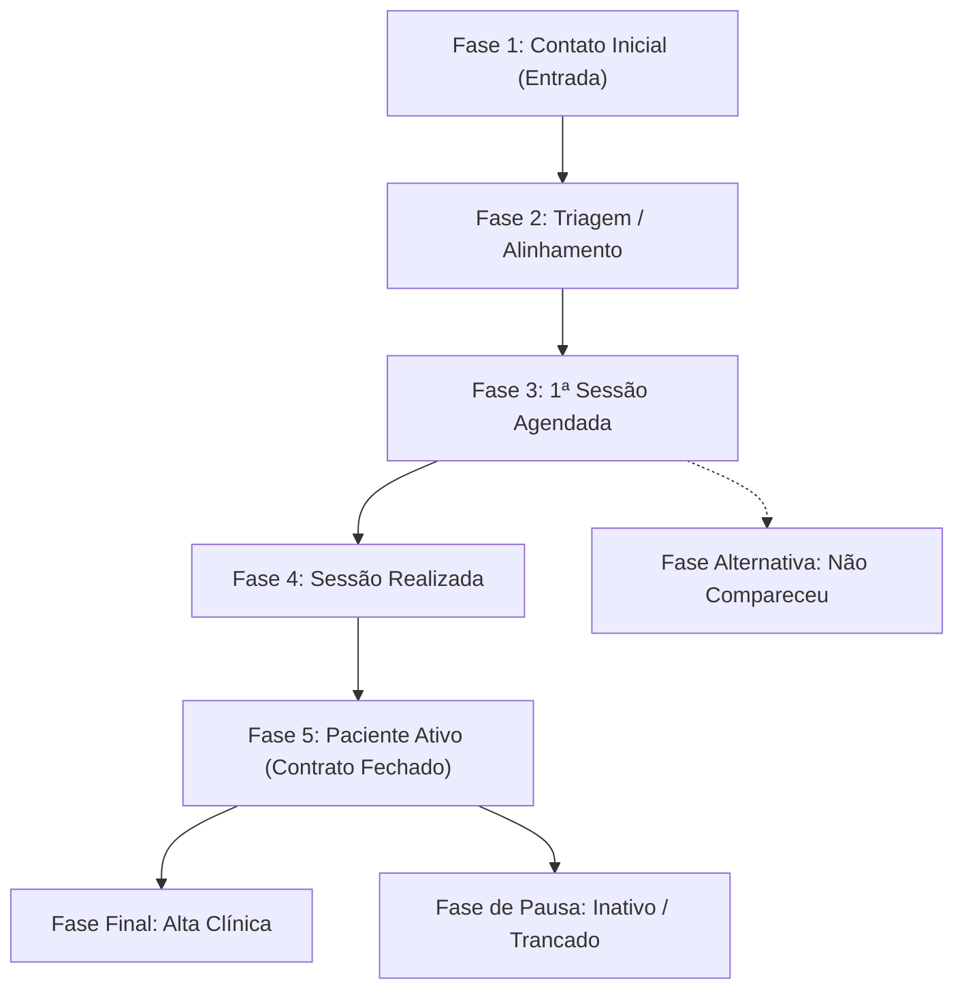

# Estudo de Produto: CRM Clínico para Psicólogos (psi-app) - Revisado

Este documento detalha o estudo de mercado e produto para a concepção do módulo de **CRM com Automações** do **psi-app**, refinado de acordo com as premissas estratégicas definidas:
1. **Pipeline Personalizável:** Estágios padrão de psicologia clínica com capacidade de edição, reordenação e adição pelo usuário (assim como no Foxbase).
2. **Webhooks e Rastreamento UTM:** Lógica idêntica à do Foxbase para captura automática de leads via API/Webhooks, resolução inteligente de fontes de tráfego por parâmetros UTM e deduplicação automática de contatos.
3. **Sem Telefonia VoIP:** Ausência completa de recursos de VoIP, discador de ligações e gravação de chamadas.
4. **WhatsApp Focado em Agendamentos:** Sem canais conversacionais activos ou chats múltiplos de vendas. O sistema usará um único WhatsApp central da plataforma exclusivamente para confirmações e lembretes automáticos de consulta.
5. **E-mail Marketing White-Label:** Inclusão de um módulo de e-mail marketing para envio de newsletters, materiais psicoeducativos e comunicados com a marca própria (domínio personalizado) do psicólogo ou da clínica.

---

## 1. Mapeamento de Recursos: Foxbase vs. psi-app

Abaixo está o mapeamento atualizado dos recursos que serão portados do Foxbase CRM, adaptados ou adicionados para atender às especificidades do psi-app:

| Recurso Foxbase | Status no psi-app | Adaptação e Implementação Técnica |
| :--- | :--- | :--- |
| **Pipeline/Kanban Editável** | **MANTER (Zustand)** | O pipeline vem pré-configurado com as etapas ideais de psicologia, mas o psicólogo pode **criar, renomear, excluir ou reordenar colunas** diretamente na UI. O estado unificado gerencia essas transições instantaneamente. |
| **Rastreamento UTM & Webhook** | **MANTER** | Endpoint de integração para capturar leads de landing pages (ex: WordPress, Elementor). Mapeia parâmetros UTM (`utm_source`, `utm_medium`, etc.) para vincular a fontes de tráfego criadas no app, e realiza a **deduplicação por e-mail ou WhatsApp**. |
| **E-mail Marketing** | **ADICIONAR (White-Label)** | Módulo para psicólogos criarem e enviarem e-mails (psicoeducação, novidades, avisos de recesso) com remetente próprio (ex: `contato@psicologo.com.br`) configurado via DNS (DKIM, SPF). |
| **Confirmação via WhatsApp** | **ADAPTAR** | Em vez de chats ativos de vendas, o sistema utiliza um **WhatsApp único da plataforma** para disparar lembretes (24h/2h antes da sessão). O paciente clica em botões ("Confirmar", "Reagendar") e a resposta atualiza a agenda no sistema. |
| **Telefonia VoIP & Gravações** | **REMOVER** | Totalmente descartados por incompatibilidade com a ética clínica (sigilo de prontuário CFP) e baixa aderência ao fluxo de psicólogos. |
| **"Registrar Venda"** | **ADAPTAR** | Substituído pelo fluxo de **"Fechar Contrato Terapêutico"** que define o valor da sessão, a recorrência (semanal/quinzenal) e a forma de acerto financeiro. |

---

## 2. A Jornada de Acolhimento do Paciente (O Funil Padrão)

Embora o psicólogo possa personalizar suas colunas de forma livre, o **psi-app** carregará um template padrão otimizado de funil de vendas/acolhimento clínico:



### Regras dos Estágios Editáveis:
* **Estágios Padrão Bloqueados para Exclusão:** Por questões de integridade do sistema, as colunas de entrada (`Contato Inicial`) e de conversão (`Paciente Ativo`) são protegidas contra deleção, mas podem ter seus nomes customizados.
* **Criação de Sub-Estágios:** Terapeutas de abordagens específicas (como TCC ou Psicanálise) podem querer adicionar colunas intermediárias (ex: "Aplicação de Questionários", "Avaliação Psiquiátrica").

---

## 3. Lógica do Webhook de Leads e Resolução UTM

Seguindo estritamente a arquitetura madura do Foxbase, o psi-app terá um webhook de entrada de novos leads com a seguinte inteligência:

### A. Fluxo de Deduplicação Automática:
Ao receber um payload do formulário do site ou de anúncios (Google/Facebook Ads):
1. O sistema verifica se o telefone (normalizado E.164) ou e-mail já existem na base da organização.
2. **Se existir:** O lead existente é atualizado, os parâmetros de UTM são vinculados à sua timeline como comentário e o sistema notifica o psicólogo de um "re-contato" de lead antigo (sem duplicar cartões no Kanban).
3. **Se for novo:** Um cartão é criado na coluna inicial (`Contato Inicial`) e o status é definido como `Novo`.

### B. Resolução de Fontes de Tráfego:
O webhook lê parâmetros `utm_source`, `utm_medium` e `utm_campaign`:
* Busca em `traffic_sources` cadastradas pela organização por correspondências.
* Se encontrar correspondência (ex: `utm_source = google`), vincula o lead à fonte "Google Ads".
* Se não houver UTM, usa a fonte informada na propriedade `source` (ex: "Instagram Orgânico") ou aplica o fallback para a fonte de sistema "Webhook".

---

## 4. Módulos de Relacionamento e Lembretes

Para suprir a remoção de VoIP e chats comerciais, o **psi-app** terá foco em dois canais de comunicação com finalidades distintas:

### A. WhatsApp do App (Confirmações de Agendamento)
O psi-app disponibiliza um canal oficial de WhatsApp integrado por trás do sistema. Este número não serve para conversação aberta, mas executa automações de agenda:
* **Disparo Automático de Lembretes:** Mensagem de texto com botões dinâmicos enviada 24 horas antes do atendimento.
  > *"Olá, [Nome do Paciente], lembrando que temos uma sessão de psicoterapia marcada para amanhã, [Data] às [Hora]. Podemos confirmar o seu comparecimento?"*
  > `[Confirmar Presença]` | `[Solicitar Reagendamento]`
* **Atualização Automática na UI:**
  * O paciente clica em `Confirmar Presença` $\rightarrow$ O card da sessão na agenda e no CRM muda para verde/status "Confirmado".
  * O paciente clica em `Solicitar Reagendamento` $\rightarrow$ O sistema notifica o psicólogo via push no app e destaca a sessão em laranja para contato manual.
* **Mensagem de No-Show:** Caso o paciente falte sem avisar, um template amigável é oferecido ao psicólogo na tela para disparo em um clique: *"Olá, percebi que você não pôde comparecer hoje. Está tudo bem? Se quiser reagendar para esta semana, tenho horários livres na [Dia] às [Hora]."*

### B. E-mail Marketing White-Label
Essencial para que o psicólogo construa autoridade e mantenha contato contínuo com sua base de pacientes e ex-pacientes de forma ética:
* **Domínio Próprio:** Ativação nas configurações de conta enviando registros DNS (CNAME/TXT) para autenticação SPF e DKIM, garantindo que os e-mails saiam sob a marca do terapeuta (ex: `dr@meudominio.com.br`).
* **Campanhas de Psicoeducação:** Envio de boletins informativos, textos psicoeducativos, exercícios práticos semanais ou lembretes sobre saúde mental.
* **Comunicados Administrativos:** Envio em massa de avisos de recessos de fim de ano, reajustes anuais de contrato terapêutico e alterações de políticas da clínica.
* **Automação Pós-Alta:** Fluxo de e-mails disparados automaticamente após o paciente entrar no status "Alta / Concluído", enviando mensagens de acompanhamento espaçadas (ex: 3 meses, 6 meses) para manter as portas do consultório abertas caso necessitem retornar.

---

## 5. Estrutura de Dados e Zustand Store

Para suportar essas premissas funcionais, o estado global gerenciado pelo **Zustand** no frontend do psi-app deve ser estruturado em duas stores principais:

### `useCrmStore` (Baseada no Foxbase leadsStore)
Garante que a manipulação de contatos, filtros e aplicação de macros seja rápida e reativa:
```typescript
interface CrmState {
  contactsById: Record<string, Contact>;
  columnIds: Record<string, string[]>; // IDs ordenados por coluna do Kanban
  pipelineColumns: PipelineColumn[]; // Configuração dinâmica de colunas
  activeFilters: ContactFilters;
  
  // Actions
  setContacts: (contacts: Contact[]) => void;
  moveContactOptimistically: (id: string, fromColumn: string, toColumn: string) => void;
  updateContact: (id: string, updates: Partial<Contact>) => void;
  addContact: (contact: Contact) => void;
  removeContact: (id: string) => void;
  
  // Customization
  updatePipelineColumns: (columns: PipelineColumn[]) => void;
}
```

### `useEmailCampaignStore` (Módulo White-Label)
Responsável por gerenciar as campanhas de e-mail marketing, listas de contatos clínicos e templates de e-mail:
```typescript
interface EmailState {
  campaigns: EmailCampaign[];
  templates: EmailTemplate[];
  sendingStatus: Record<string, 'idle' | 'sending' | 'completed'>;
  
  // Actions
  fetchCampaigns: () => Promise<void>;
  createCampaign: (campaign: NewCampaign) => Promise<void>;
  sendCampaign: (id: string) => Promise<void>;
}
```

---

## 6. Próximos Passos Focados na Construção

Com a consolidação dessas premissas, podemos declarar a fase de design de produto concluída e passar para a estruturação técnica:
1. **Migrações de Banco de Dados:** Criar a estrutura para `pipeline_columns` (personalização do Kanban), `contacts` (com UTMs e deduplicação), `email_campaigns` (para white-label) e `platform_settings` (armazenamento do WhatsApp de agendamento e chaves DNS do e-mail).
2. **Definição de Protótipo e Layout:** Desenhar a tela de pipeline dinâmico e o cockpit de agendamento integrado à agenda médica.
